## Table of contents
### [1. Назначение и классификация операционных систем.](#1)
### [2. Понятие WinAPI и его применение при разработке прикладных программ.](#2)
### [3. Процессы и потоки.](#3)
### [4. Планирование в системах с одним процессором.](#4)
### [5. Планирование в многопроцессорных системах.](#5)
### [6. Переключение потоков и краткосрочное планирование.](#6)
### [7. Приоритеты процессов и потоков.](#7)
### [8. Синхронизация, механизмы синхронизации.](#8)
### [9. Виртуальное адресное пространство процесса.](#9)
### [10. Страничная адресация и работа файла подкачки.](#10)
### [11. Управление памятью в системах Windows (динамическая память).](#11)
### [12. Библиотеки динамической компоновки DLL.](#12)
### [13. Явное и неявное связывание библиотек динамической компоновки.](#13)
### [14. Организация дискового пространства.](#14)
### [15. Организация файловой системы FAT32.](#15)
### [16. Организация файловой системы NTFS.](#16)

# 1. Назначение и классификация операционных систем.
##### 1 
[Наверх](#table-of-contents)

Операционная система — комплекс взаимосвязанных программ, предназначенных для управления ресурсами компьютера и организации взаимодействия с пользователем.
В логической структуре типичной вычислительной системы операционная система занимает положение между устройствами с их микроархитектурой, машинным языком и, возможно, собственными (встроенными) микропрограммами (драйверами) — с одной стороны — и прикладными программами с другой.

## Основные функции:

* Исполнение запросов программ (ввод и вывод данных, запуск и остановка других программ, выделение и освобождение дополнительной памяти и др.).
* Загрузка программ в оперативную память и их выполнение.
* Стандартизованный доступ к периферийным устройствам (устройства ввода-вывода).
* Управление оперативной памятью (распределение между процессами, организация виртуальной памяти).
* Управление доступом к данным на энергонезависимых носителях (таких как жёсткий диск, оптические диски и др.), организованным в той или иной файловой системе.
* Обеспечение пользовательского интерфейса.
* Сохранение информации об ошибках системы.

## Дополнительные функции:

* Параллельное или псевдопараллельное выполнение задач (многозадачность).
* Эффективное распределение ресурсов вычислительной системы между процессами.
* Разграничение доступа различных процессов к ресурсам.
* Организация надёжных вычислений (невозможности одного вычислительного процесса намеренно или по ошибке повлиять на вычисления в другом процессе), основана на разграничении доступа к ресурсам.
* Взаимодействие между процессами: обмен данными, взаимная синхронизация.
* Защита самой системы, а также пользовательских данных и программ от действий пользователей (злонамеренных или по незнанию) или приложений.
* Многопользовательский режим работы и разграничение прав доступа (см.: аутентификация, авторизация).

## Классификация

* По применению на различных типах аппаратных средств
    * мейнфреймов и суперкомпьютеров
    * серверные
    * многопроцессорные
    * персональные
    * мобильных устройств
    * реального времени

* По типу ядра:
    - Монолитное - все функции внутри ядра, но тяжело расширять
    - Модульное - разновидность монолитного ядра, разбивается на модули, например драйверы
    - Микроядро - содержит только набор минимально необходимых функции, быстродействие, расширение
    - Наноядро - микроядро, которое почти ничего не делает, обменивается данными и соединяет компоненты
    - Экзоядро - гипервизоры, супер продвинутая система, которая управляет несколькими ядрами
    - Гибридное ядро - соединяет микро и монолит

___

* По семейству систем: 
    * cистемы семейства Windows, MS-DOS
    * Unix
    * UNIX-подобные системы. (Linux, MacOS, BSD)
* По количеству одновременно работающих пользователей:
    * Однопользовательские ОС позволяют работать на компьютере только одному человеку. (однопользовательские однозадачные – пакетные, MS-DOS, однопользовательские многозадачные – Windows, Linux, Mac OS)
    * Многопользовательские ОС поддерживают одновременную работу на ЭМВ нескольких пользователей за различными терминалами. (многопользовательские многозадачные – сетевые ОС: NetWare, Unix, OS/2, Windows NT)
* По числу процессов, одновременно выполняемых под управлением системы:    
    * Однозадачные ОС поддерживают выполнение только одной программы в отдельный момент времени, то есть позволяют запустить одну программу в основном режиме. (DOS)
    * Многозадачные ОС (мультизадачные) поддерживают параллельное выполнение нескольких программ, существующих в рамках одной вычислительной системы на некотором отрезке времени, то есть позволяют запустить одновременно несколько программ, которые будут работать параллельно, не мешая друг другу.
* По количеству поддерживаемых процессоров (однопроцессорные, многопроцессорные):
    * Многопроцессорные ОС поддерживают режим распределения ресурсов нескольких процессоров для решения той или иной задачи. При многопроцессорном режиме работы два или несколько соединенных и примерно равных по характеристикам процессора совместно выполняют один или несколько процессов (программ или наборов команд). Цель такого режима – увеличение быстродействия или вычислительных возможностей. **Многопроцессорные ОС разделяют на симметричные и асимметричные.**
        * В симметричных ОС на каждом процессоре функционирует одно и то же ядро, и задача может быть выполнена на любом процессоре, то есть обработка полностью децентрализована. При этом каждому из процессоров доступна вся память.
        * В асимметричных ОС процессоры неравноправны. Обычно существует главный процессор (master) и подчиненные (slave), загрузку и характер работы которых определяет главный процессор
* По типу доступа пользователя к ЭВМ:        
    * ОС пакетной обработки: в них из программ, подлежащих выполнению, формируется пакет заданий, вводимых в ЭВМ и выполняемых в порядке очередности с возможным учетом приоритетности.
    * ОС разделения времени обеспечивают одновременный диалоговый (интерактивный) режим доступа к ЭВМ нескольких пользователей на разных терминалах, которым по очереди выделяются ресурсы машины, что координируется операционной системой в соответствии с заданной дисциплиной обслуживания. Каждой программе, находящейся в оперативной памяти и готовой к исполнению, выделяется для исполнения фиксированный, задаваемый в соответствии с приоритетом пользователя интервал времени. Если программа не выполнена до конца за этот интервал, ее исполнение принудительно прерывается, и программа переводится в конец очереди.
    * ОС реального времени обеспечивают определенное гарантированное время ответа машины на запрос пользователя с управлением им какими-либо внешними по отношению к ЭВМ событиями, процессами или объектами. При таком режиме ЭВМ управляет некоторым внешним процессом, обрабатывая данные и информацию, непосредственно поступающую от объекта управления.
* По разрядности кода операционной системы: восьмиразрядные, шестнадцатиразрядные, тридцатидвухразрядные, шестидесяти четырехразрядные.
* По типу интерфейса
    * командные (текстовые)
    * графические

# 2. Понятие WinAPI и его применение при разработке прикладных программ.
##### 2 
[Наверх](#table-of-contents)

**Кратко: API (интерфейс прикладного программирования) упрощает процесс программирования при создании приложений, абстрагируя базовую реализацию и предоставляя только объекты или действия, необходимые разработчику. Windows API предназначен для создания программистами прикладных программ, т.к. система без возможности разрабатывать под нее приложения скорее всего бесполезна. Иначе бы пришлось самим рисовать формочки, читать с жесткого диска и прочее. Называтся он программным интерфейсом, потому что реализует контракт программирования (как что использовать, что вызывать).** 

API (программный интерфейс приложения) (англ. application programming interface) — описание способов (набор классов, процедур, функций, структур или констант), которыми одна компьютерная программа может взаимодействовать с другой программой. Часто реализуется отдельной программной библиотекой или сервисом операционной системы. Используется программистами при написании всевозможных приложений.

Windows API -  общее наименование набора базовых функций интерфейсов программирования приложений операционных систем семейства Windows. Предоставляет прямой способ взаимодействия приложений пользователя с операционной системой Windows. Для создания программ, использующих Windows API, корпорация Майкрософт выпускает комплект разработчика программного обеспечения, который называется Platform SDK и содержит документацию, набор библиотек, утилит и других инструментальных средств для разработки.

Работа через Windows API — это наиболее близкий к операционной системе способ взаимодействия с ней из прикладных программ. Более низкий уровень доступа, необходимый только для драйверов устройств, в текущих версиях Windows предоставляется через Windows Driver Model.

Windows API представляет собой множество функций, структур данных и числовых констант, следующих соглашениям языка Си. В то же время конвенция вызова функций отличается от cdecl, принятой для языка C: Windows API использует stdcall (winapi). Все языки программирования, способные вызывать такие функции и оперировать такими типами данных в программах, исполняемых в среде Windows, могут пользоваться этим API. В частности, это языки C++, C#, Pascal, Visual Basic и многие другие.

Для облегчения программирования под Windows в компании Microsoft и сторонними разработчиками было предпринято множество попыток создать библиотеки и среды программирования, фреймворки (.Net, WinForms, WPF, Qt, Tk). Весомая часть этих библиотек сконцентрирована на облегчении программирования графического интерфейса пользователя.

Все программы, скомпилированные под Windows, так или иначе используют Windows API, поскольку это практически единственный способ общения с операционной системой на прикладном уровне. В режиме совместимости системные вызовы из одной OS конвертируются в системные вызовы другой (Wine под Linux).

Версии WinAPI отличаются используемой разрядностью (16-32-64).

    Может спросить, как подключить библиотеку (файл Windows.h), откуда она вообще берется.

# 3. Процессы и потоки.
##### 3

[Наверх](#table-of-contents)

## Определение 
* Процесс — экземпляр программы во время выполнения, независимый объект, которому выделены системные ресурсы (например, процессорное время и память). Каждый процесс выполняется в отдельном адресном пространстве: один процесс не может получить доступ к переменным и структурам данных другого. Если процесс хочет получить доступ к чужим ресурсам, необходимо использовать межпроцессное взаимодействие. Это могут быть конвейеры, файлы, каналы связи между компьютерами и многое другое.
* Поток использует то же самое пространства стека, что и процесс, а множество потоков совместно используют данные своих состояний. Как правило, каждый поток может работать (читать и писать) с одной и той же областью памяти, в отличие от процессов, которые не могут просто так получить доступ к памяти другого процесса. У каждого потока есть собственные регистры и собственный стек, но другие потоки могут их использовать. Поток — определенный способ выполнения процесса. Когда один поток изменяет ресурс процесса, это изменение сразу же становится видно другим потокам этого процесса.

## Альтернативное определение

* Процесс (process) — не что более иное, как некая абстракция, которая инкапсулирует в себе все ресурсы процесса (открытые файлы, файлы отображенные в память...) и их дескрипторы, потоки и т.д. Каждый процесс имеет как минимум один поток. Также каждый процесс имеет свое собственное виртуальное адресное пространство и контекст выполнения, а потоки одного процесса разделяют адресное пространство процесса.
* Поток (thread) — это, сущность операционной системы, процесс выполнения на процессоре набора инструкций, точнее говоря программного кода. Общее назначение потоков — параллельное выполнение на процессоре двух или более различных задач. Как можно догадаться, потоки были первым шагом на пути к многозадачным ОС. Планировщик ОС, руководствуясь приоритетом потока, распределяет кванты времени между разными потоками и ставит потоки на выполнение.

---
* Варианты **создания** процессов
    * Инициализация системы
    * Выполнение работающим процессом системного вызова, предназначенного для создания другого процесса
    * Запрос пользователя на создание новго процесса
    * Инициация пакетного задания
* Как могу **завершаться** процессы
    * Обычный выход (добровольно)
    * Выход при возникновении ошибки (добровольно)
    * Возникновение фатальной ошибки (принудительно)
    * Уничтожение другим процессом (принудительно)
* Информационные структуры описывающие процессы
    * Таблица процессов. Одна запись на каждый процесс.
    * Блок управления процессом (дескриптор,  process control block, PCB). Описывает свой 
    процесс и его текущее состояние, нужна для управления процессом. Дескриптор процесса – это информационная структура, которая описывает внешнюю структуру (информацию) процесса (нужна планировщику для выполнения процесса, а так же нужна ядру в течение всего жизненного цикла процесса) В состав дескриптора входят:
        * Идентификатор процесса;
        * Состояние процесса.
        * Информация о привилегированности процесса.
        * Информация о расположении кодового сегмента.
    * Образ процесса. Process Image. Память выделанная для процесса. То, как программа представлена в **виртуальном адресном пространстве**.
    * Контекст процесса. Контекст процесса содержит информацию о внутреннем состоянии процесса, а также отражает состояние аппаратуры в момент прерывания процесса и включает параметры операционной среды. Содержит часть информации необходимой для возобновления выполнения процесса с прерванного места. В состав контекста процесса входит:

        * содержимое регистров процессора (включает счётчик команд, т.е. на каком этапе находится процесс);
        * размещение кодового сегмента;
        * информацию об открытых данным процессом файлах;
        * информацию о работах с внешними устройствами (+ коды ошибок выполненных процессором, системных вызовов, незавершенных операциях ввода-вывода).

---

Создание процесса в Windows:
* ОС создает соответсвующие служебные объекты, с помощью которых управляют процессом (объект процесса, объект первичный поток)
    1. Преобразование и проверка приемлимости параметров и флагов
    2. Открытие exe файла и создание объекта раздела
    3. Создание процесса Windows
    4. Создание объекта потока Windows
    * **Инициализация подсистемы Windows**
    5. Выполнение инициализации характерного для подсистемы Windows процесса, запускается после создания данного процесса
    6. Исходный процесс возвращает выполнение исходному коду
    * **Новый процесс**
    7. Заключительная часть инициализации новго процесса и образа
    8. Начало выполнения с точки входа в образ

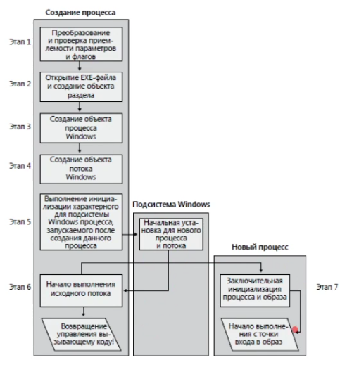

Создание процесса в Unix
* Родительский PCB создает дочерний PCB копируя себя полностью, кроме PID (адресное пространство дочернего процесса сперва даже хранит код родительского)

## Подробнее

* Системный вызов (syscall)  — это процесс вызова функции ядра, из приложение пользователя. 
* Режим ядра — код, который выполняется в нулевом кольце защиты процессора (ring0) с максимальными привилегиями. 
* Режим пользователя — код, исполняемый в третьем кольце защиты процессора (ring3), обладает пониженными привилегиями. Если код в ring3 будет использовать одну из запрещенных инструкций (к примеру rdmsr/wrmsr, in/out, попытку чтения регистра cr3, cr4 и т.д.), сработает аппаратное исключение и пользовательский процесс, чей код исполнял процессор в большинстве случаях будет прерван. 

Каждый поток, как и каждый процесс, имеет свой контекст. Контекст — это структура, в которой сохраняются следующие элементы:
* Регистры процессора.
* Указатель на стек потока/процесса.

В случае выполнения системного вызова потоком и перехода из режима пользователя, в режим ядра, происходит смена стека потока на стек ядра. При переключении выполнения потока одного процесса, на поток другого, ОС обновляет некоторые регистры процессора, которые ответственны за механизмы виртуальной памяти (например CR3), так как разные процессы имеют разное виртуальное адресное пространство

### Что использовать - процессы или потоки?
* Если ваша задача требует интенсивного распараллеливания, используйте потоки одного процесса, вместо нескольких процессов. Все потому, что переключение контекста процесса происходит гораздо медленнее, чем контекста потока.
* При использовании потока, старайтесь не злоупотреблять средствами синхронизации, которые требуют системных вызовов ядра (например мьютексы). Переключение в редим ядра — дорогостоящая операция!
* Если вы пишете код, исполняемый в ring0 (к примеру драйвер), старайтесь обойтись без использования дополнительных потоков, так как смена контекста потока — дорогостоящая операция.

Волокно (fiber) — облегченный поток, выполняемый в режиме пользователя. Волокно затребует значительно меньше ресурсов, и позволяет в некоторых случаях минимизировать количество системных вызовов и следственно увеличить производительность.

## Классификация потоков

* По отображению в режиме ядра
    * Центральный планировщик ОС режима ядра, который распределяет время между любым потоком в системе. (1:1).
    * Планировщик библиотеки потоков. У библиотеки потоков режима пользователя может быть свой планировщик, который распределяет время между потоками различных процессов режима пользователя. (N:M)
    * Планировщик потоков процесса. Уже рассмотренные нами волокна, ставятся на выполнение именно таким способом. К примеру свой Thread Manager есть у каждого процесса Mac OS X, написанного с использованием библиотеки Carbon. (N:1)
    ---
    * Модель 1:1 — самая простая модель. Согласно ее принципам, любой поток созданный в любом процессе управляется напрямую планировщиком ядра ОС. Т.е. имеем отображении 1 к 1 потока пользовательского процесса на поток ядра. Такая модель реализована в Linux начиная с ядра 2.6, а также Windows.
    * Модель N:M отображает некоторое число потоков пользовательских процессов N на M потоков режима ядра. Проще говоря имеем некую гибридную систему, когда часть потоков ставится на выполнение в планировщике ОС, а большая их часть в планировщике потоков процесса или библиотеки потоков. Как пример можно привести GNU Portable Threads. Данная модель достаточно трудно реализуема, но обладает большей производительностью, так как можно избежать значительного количества системных вызовов.
    * Модель N:1. Множество потоков пользовательского процесса отображаются на один поток ядра ОС. Например волокна.
    ---
* По многозадачной модели
    * Кооперативная многозадачность - все потоки выполняются поочередно, с равным временем выполнения. Никакой другой поток, не может вытеснить текущий выполняющийся поток. 
    * Вытесняющая многозадачность - стало понятно, что некоторые потоки должны иметь больший приоритет, как-то потоки обслуживания прерываний устройств, обработки синхронных IO операций и т.д. В это время каждый поток и процесс в системе обзавелся таким свойством, как приоритет.Таким образом поток с большим приоритетом, может вытеснить поток с меньшим. Сейчас все современные ОС используют данный подход, за исключением реализации волокон в пользовательском режиме.
* По уровню реализации
    * Реализация потоков на уровне ядра. Проще говоря, это классическая 1:1 модель. Под эту категорию подпадают:
        * Потоки Win32.
        * Реализация Posix Threads в Linux — Native Posix Threads Library (NPTL).
        * Легковесные ядерны потоки (Leight Weight Kernel Threads — LWKT), например в DragonFlyBSD. Отличие этих потоков, от других потоков режима ядра в том, что легковесные ядерные потоки могут вытеснять другие ядерные потоки.
    * Реализация потоков в пользовательском режиме. Так как, системный вызов и смена контекста — достаточно тяжелые операции, идея реализовать поддержку потоков в режиме пользователя витает в воздухе давно. Множество попыток было сделано, однако данная методика популярности не обрела:
        * GNU Portable Threads — реализация Posix Threads в пользовательском режиме. Основное преимущество — высокая портабельность данной библиотеки, проще говоря она может быть легко перенесена на другие ОС. Проблему вытиснения потоков в данной библиотеке решили очень просто — потоки в ней не вытесняются :) Ну и конечно ни о какой мультмпроцессорности речь идти не может. Данная библиотека реализует модель N:1.
        * Carbon Threads и RealBasic Threads.
        * Гибридная реализация. Попытка использовать все преимущества первого и второго подхода, но как правило подобные мутанты обладают гораздо бОльшими недостатками, нежели достоинствами. Один из примеров: реализация Posix Threads в NetBSD по модели N:M, которая была посже заменена на систему 1:1. Более подробно вы можете прочесть в публикации Scheduler Activations: Effective Kernel Support for the User-Level Management of Parallelism.

## Потоки в Win32 API
Потоки в Win32 создаются с помощью функции CreateThread, куда передается указатель на функцию (назовем ее функцией потока), которая будет выполнятся в созданом потоке. Поток считается завершенным, когда выполнится функция потока. Функция ExitThread будет вызвана неявно, когда завершится функция потока, или же вы можете вызвать данную функцию самостоятельно. Главная ее задача — освободить стек потока и его хендл, т.е. структуры ядра, которые обслуживают данный поток.

Поток в Win32 может пребывать в состоянии сна (suspend). Можно «усыпить поток» с помощью вызова функции SuspendThread, и «разбудить» его с помощью вызова ResumeThread, также поток можно перевести в состояние сна при создании, установив значение параметра СreateSuspended функции CreateThread. Не стоит удивлятся, если вы не увидите подобной функциональности в кроссплатформенных библиотеках, типа boost::threads и QT. Все очень просто, pthreads просто не поддерживают подобную функциональность.

**Средства синхронихации в Win32 есть двух типов: реализованные на уровне пользователя, и на уровне ядра. Первые — это критические секции (critical section), к второму набору относят мьютексы (mutex), события (event) и семафоры (semaphore).**

Критические секции — легковесный механизм синхронизации, который работает на уровне пользовательского процесса и не использует тяжелых системных вызовов. Он основан на механизме взаимных блокировок или спин локов (spin lock). Поток, который желает обезопасить определенные данные от race conditions вызывает функцию EnterCliticalSection/TryEnterCriticalSection. Если критическая секция свободна — поток занимает ее, если же нет — поток блокируется (т.е. не выполняется и не отъедает процессорное время) до тех пор, пока секция не будет освобождена другим потоком с помощью вызова функции LeaveCriticalSection. Данные функции — атомарные, т.е. вы можете не переживать за целостность ваших данных.

У мьютексов, событий и семафоров есть общие черты:
* Они использует примитивы ядра при выполнении, т.е. системные вызовы, что сказывается на производительности.
* Могут быть именованными и не именованными, т.е. каждому такому объекту синхронизации можно присвоить имя.
* Работают на уровне системы, а не на уровне процесса, т.е. могут служить механизмом межпроцессного взаимодействия (IPC).
* Используют для ожидания и захвата примитива единую функцию: WaitForSingleObject/WaitForMultipleObjects.

# 4. Планирование в системах с одним процессором.
#### 4
[Наверх](#table-of-contents)

**Планирование** - обеспечение поочередного доступа процессов к одному процессору.

**Планировщик** - отвечающая за это часть операционной системы.

**Алгоритм планирования** - используемый алгоритм для планирования.

Воздействовать на планировщик можно только с помощью приоритетов или привязок, самостоятельно определять, по какому алгоритму планировщик будет переключать процессы - нельзя.

Но можно планировать в режиме пользователя с помощью заданий и волокон. Планировщик не знает про волокно, это специальный поток, и он не планируется планировщиком. Планировщиком для этого волокна становится тот поток, который его создал. Т.е. внутри потока создаются волокна, процессорное время отдается потоку, а сам поток уже распределяет время между волокна. Стоит учитывать, что волокна применимы только в многопоточном приложении.

### Задача планирования процессов состоит из трех действий:

* Определение момента времени для смены, выполняемого в данный момент, процесса.
* Выбор того процесса из очереди готовности, которому будет передано управление.
* Переключение контекста (переключение между процессами).

### Ситуации, когда необходимо планирование:
* Когда создается процесс
* Когда процесс завершает работу
* Когда процесс блокируется на операции ввода/вывода, семафоре, и т.д.
* При прерывании ввода/вывода.

### Классы планировщиков
* Пакетный – ориентирован на длительные задачи, которые требуют больших вычислительных ресурсов, где не требуется частое прерывание. Т.е. подразумевают обработку больших задач большими пакетами, нет ограничения на время выполнения.
* Интерактивный – ориентирован на снижение времени отклика, т.е. чтобы система казалась”отзывчивой”Обычные абонентские системы на ПК – это интерактивные системы, когда в ответ на действие пользователя (например перемещение мыши) ОС что-то делает. И всегда пользователю хочется, чтобы этот ответ происходил как можно быстрее.
Главное чтобы на поступающий в систему запрос был получен максимально быстро ответ. Запрос – это любое взаимодействие с компьютером.
* Реального времени – специализированные класс, ориентированный на дедлайн – предельный срок завершения какой-либо работы.Главное, чтобы определенное действие завершалось к определенному сроку, это понятие называется дедлайн.Поступающий запрос должен быть обработан не более, чем в определенный промежуток времени.Классический пример СРВ – управление ядерным реактором, в котором превышение времени отклика приведет к аварийной ситуации.

### Уровни планирования
* Долговременное(догосрочное) – решает какие новые задачи будут добавлены (концептуальные вопросы).
* Среднесрочное – решает нужно ли временно выгружать программу во вторичную память (какую и вообще нужно ли это).
* Краткосрочный – решает, какому потоку дать следующий квант процессорного времени и какой длины. Координирует выполняющиеся потоки на разных ЦП.

## Типы многозадачности
* Невытесняющие. Активная задача выполняется до тех пор, пока она сама, по собсвтенной инициативе, не отдаст управление ОС для того, чтобы та выбрала из очереди другую задачу, готовую к выполнению. В этом случае находящийся в состоянии выполнения процесс продолжает выполнение до тех пор, пока он не завершится или пока не окажется в заблокированном состоянии ожидания завершения операции ввода-вывода или запроса некоторого системного сервиса.
* Вытесняющие. Решение о переключении процессора с одной задачи на другую принимается ОС. Выполняющийся в настоящий момент процесс может быть прерван и переведен операционной системой в состояние готовности к выполнению. Решение о вытеснении может приниматься при запуске нового процесса по прерыванию, которое переводит заблокированный процесс в состояние готовности к выполнению, или периодически — на основе прерываний таймера.

## Алгоритмы планирования

### Cистемы

* Системы пакетной обработки - могут использовать неприоритетный и приоритетный алгоритм (например: для расчетных программ).
* Интерактивные системы - могут использовать только приоритетный алгоритм, нельзя допустить чтобы один процесс занял надолго процессор (например: сервер общего доступа или персональный компьютер).
* Системы реального времени - могут использовать неприоритетный и приоритетный алгоритм (например: система управления автомобилем).

### Задачи алгоритмов планирования:

* Для всех систем
    * Справедливость - каждому процессу справедливую долю процессорного времени
    * Контроль над выполнением принятой политики
    * Баланс - поддержка занятости всех частей системы (например: чтобы были заняты процессор и устройства ввода/вывода)
* Системы пакетной обработки
    * Пропускная способность - количество задач в час
    * Оборотное время - минимизация времени на ожидание обслуживания и обработку задач.
    * Использование процесса - чтобы процессор всегда был занят.
* Интерактивные системы
    * Время отклика - быстрая реакция на запросы
    * Соразмерность - выполнение ожиданий пользователя (например: пользователь не готов к долгой загрузке системы)
* Системы реального времени
    * Окончание работы к сроку - предотвращение потери данных
    * Предсказуемость - предотвращение деградации качества в мультимедийных системах (например: потерь качества звука должно быть меньше чем видео)

### Алгоритмы планирования

В зависимости от того, какие критерии накладываются, алгоритмы планирования могут основываться на квантовании времени и приоритетах.

* Невытесняющие:
    * **FIFO (First In First Out)** – простейший алгоритм, выбирающий для запуска следующий процесс из очереди. На графике отображено время выполнения нескольких процессов, видно что они запускаются последовательно в порядке поступления в очередь. В этом алгоритме не учитываются какие-либо показатели процесса, поэтому он эффективен лишь в очень простых, либо специально подготовленных случаях.

    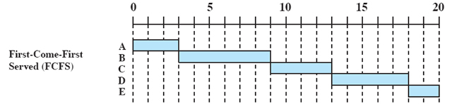

    * **Сначала самое короткое задание (Shortest Process Next)** – очередь выстраивается так, чтобы первыми выполнялись небольшие задачи. Хотя этот способ и эффективнее FIFO в большинстве случаев, он все же неэффективно использует вычислительные ресурсы, например, не рассматривается ситуация, когда процесс ничего не делает, ведь тогда компьютер будет простаивать. Однако основная проблема это необходимость определения времени выполнения процесса. Невозможно точно его определить, оценка времени выполнения это довольно сложная задача, требующая отдельного рассмотрения

        

* Вытесняющие:
    * **Циклическое планирование (Round Robin)**. Модификация алгоритма FIFO, где каждому процессу выделяется определенный промежуток времени (квант) в течении которого он может выполняться, после которого выполняется следующий процесс. В общем случае квант выделяется фиксированного размера. Такой подход использовался в старых операционных системах, и, в своем базовом варианте он очень не эффективен: если квант слишком маленький, то смена контекста будет выполняться слишком часто, процессор будет терять слишком много времени на это. А если квант слишком большой, то система просто будет "тормозить". Преимущество этого алгоритма в том, что его довольно просто реализовать и использовать как часть другого алгоритма.

        

    * **Наименьшее оставшееся время выполнения**. Этот алгоритм похож на тот, где выбирается самое короткое задание, с одним отличием: какой-нибудь долго выполняющийся процесс может быть вытеснен, чтобы какой-нибудь другой процесс закончил все свои дела, тем самым освободив очередь для новых заданий. Это довольно эффективный алгоритм, но он не может использоваться в системах общего назначения, из-за той же проблемы, что и в SPN-алгоритме — необходимость оценивать время выполнения процесса.

            

# 5. Планирование в многопроцессорных системах.
##### 5
[Наверх](#table-of-contents)

Использования многопроцессорных систем позволяет обеспечить настоящую, а не псевдомногозадачность.
На одном процессоре один поток быстро переключается и создает иллюзию многозадачности.

На однопроцессорной машине планирование одномерно. Единственный вопрос, на который должен быть каждый раз получен ответ, – какой процесс должен быть запущен следующим? На мультипроцессоре планирование двумерно. Планировщик должен решить, какой процесс и на котором центральном процессоре запустить. Это дополнительное измерение существенно усложняет планирование процессов на многопроцессорных машинах. Другой усложняющий фактор состоит в том, что в ряде случаев все процессы являются независимыми, тогда как в других случаях они формируют груп­пы.

Компьютеры с несколькими процессорами обычно разрабатываются для одной из двух архитектур: неоднородный доступ к памяти (non-uniform memory access, NUMA) или симметричная многопроцессорная обработка (symmetric multiprocessing, SMP).

На компьютере NUMA каждый процессор находится ближе к некоторым частям памяти, чем другие, что позволяет ускорить доступ к памяти для некоторых частей памяти, чем другие части. В модели NUMA система пытается запланировать потоки на процессоры, близкие к используемой памяти. 

На компьютере SMP два или более идентичных процессоров или ядер подключаются к одной общей основной памяти. В модели SMP любой поток может быть назначен любому процессору. Поэтому планирование потоков на компьютере SMP аналогично планированию потоков на компьютере с одним процессором. Однако планировщик имеет пул процессоров, что позволяет планировать параллельное выполнение потоков. Планирование по-прежнему определяется приоритетом потоков, но на него можно повлиять, установив сходство потоков и идеальный процессор для потоков (фукнции винды).

### Планирование
* Ведение списка или множества списков для разных приоритетов. Освобождающиеся процессоры выбирают процессы из списка по очереди.
* «умное планирование». Если процесс входит в критическую область, захватывается мьютекс, то он не останавливается по кванту времени, а выполняется до освобождения мьютекса.
* Родственное планирование. По возможности процессы отправляются на обработку к тому процессору, который обрабатывал их до этого (CPU Affinity). Связано это с тем, что нужные данные уже могут находиться в кэше, отсюда работа будет быстрее.
* Планирование по модели «производитель-потребитель».

## Алгоритмы планирования в многопроцессорных системах (SMP)

* Планирование глобальной очереди: поддержание глобальной очереди выполнения, которая является общей для всех ЦП. Когда процессор простаивает, он может выбрать процесс из глобальной очереди выполнения и начать работу. Балансировка нагрузки в таком механизме выполняется автоматически, однако она не масштабируема (увеличение числа процессоров из-за глобальной блокировки конкуренции) и имеет низкую степень использования кэша, поскольку каждый процесс может быть 
перепланирован на другой процессор.
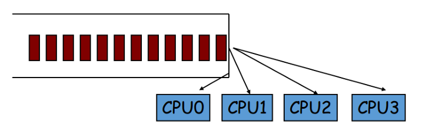  

* Планирование для каждой очереди: в этой методологии статически поддерживаются отдельные очереди готовности для каждого процессора и процессов разделения. В этом сценарии использование кэша является оптимальным, поскольку каждому процессу при перепланировании выделяется один и тот же процессор. Однако некоторые процессоры могут иметь больше процессов и выполнять больше работы, в то время как другие могут оставаться в режиме ожидания, создавая таким образом дисбаланс нагрузки.
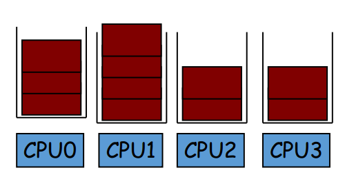  

* Приоритетное планирование. Поддерживайте динамический приоритет для каждого процесса, который обратно пропорционален недавнему использованию ЦП, и составляйте расписание в соответствии с ним, чтобы обеспечить справедливость для всех процессов. При работе с многопроцессорными системами с общей памятью справедливость - не единственный критерий, который следует учитывать. Следует учитывать хорошее использование кэша и сокращение времени ожидания конкуренции .
* График передачи обслуживания: Планирование передачи обслуживания выглядит с точки зрения процесса прерывания для повышения производительности. Идея такая: Блокирующий процесс должен иметь возможность передать оставшуюся часть своего временного интервала другому процессу, который может ускорить событие, которого ожидает блокирующий процесс. Следующий процесс для передачи может быть выбран как - Когда вытесняемый процесс удерживает блокировку, процессы, вращающиеся на этой блокировке, передают ему свои временные интервалы. Но есть много причин, по которым стратегия передачи обслуживания может не работать:
    * В практических ситуациях мало времени ожидания и достаточно параллелизма, так что нет простаивающих процессоров.
    * Скорость и накладные расходы переключения контекста идут вверх, а следующий процесс запускается только в течение оставшейся части временного интервала.
* Планирование банды (совместное планирование). В этой стратегии все выполняемые процессы приложения (группы процессоров) планируются для одновременного запуска на процессорах. Это помогает уменьшить конкуренцию и блокировку процессов. Хотя эта стратегия решает проблему блокировок с ожиданием занятости, у нее есть много других недостатков. Стратегия централизованного планирования между процессорами становится узким местом для больших компьютеров с множеством процессов. Данные, загружаемые в кэш приложением, в большинстве случаев переопределяются промежуточными приложениями, что приводит к снижению производительности кеша.
Групповое планирование также приводит к фрагментации процессоров, когда есть приложения, которые не используют все процессоры в системе, но оставляют слишком мало процессоров для одновременного запуска любого другого приложения.

* Планирование сходства: Планирование сходства - это стратегия, которая напрямую фокусируется на производительности кеша. Если процессы перепланированы на процессоры, для которых они имеют высокое сходство, большая часть исходных данных процессов все еще будет в кэше, и частота попаданий улучшится. Вот некоторые важные вопросы, которые необходимо решить при планировании сходства: 
    * Как мы можем рассчитать значения близости? - сведения о фактическом объеме данных отсутствуют.
    * Как найти баланс между сходством и справедливостью? - оба они стремятся достичь противоположных целей.

# 6. Переключение потоков и краткосрочное планирование.
##### 6
[Наверх](#table-of-contents)

cм. 3,4

**Краткосрочный планировщик решает, какой из процессов, находящихся в очереди готовых процессов, должен быть передан на выполнение в CPU.**

Планировщик на этом уровне решает, какие из готовых и загруженных в память процессов будут запущены на ЦПУ после прерывания (по времени, операции ввода-вывода, вызову операционной системы или другому сигналу). Решения на этом уровне приходится принимать очень часто (как минимум, каждый временной отрезок). Также планировщик может поддерживать или не поддерживать вытесняющую многозадачность (то есть иметь возможность прервать исполнение какого-либо процесса).

На уровне краткосрочного планирования объектом управления являются процессы, которые выступают как потребители центрального процессора для внутренних процессов или внешнего процессора для внешних процессов. Причинами порождения процесса могут быть процессы на том же уровне или сигналы, посылаемые от долгосрочного планировщика.

Выделение процессора процессу производится многократно, с целью достижения эффекта мультипрограммирования, и такой процесс называется диспетчеризацией.

Краткосрочный планировщик запускается сильно чаще остальных планировщиков и может руководствоваться приоритетом потоков.

Приоритет потока определяет, насколько чаще данный
поток будет получать кванты процессорного времени
по сравнению с другими потоками. Таким образом,
программа, выполняющая некоторые конечные
действия в потоке, будет выполнена быстрее при
повышении приоритета и медленнее при понижении.

Чтобы переключить потоки, нужно сменить контекст потока и т.д.

Переключение контекста (англ. context switch) - это процесс записи и восстановления состояния процесса или потока таким образом, чтобы в дальнейшем продолжить его выполнение с прерванного места. Этот механизм позволяет нескольким процессам разделить между собой ресурсы одного центрального процессора. Является особенностью многозадачных ОС.

При переключении контекста происходит сохранение и восстановление следующей информации

* Регистровый контекст регистров общего назначения (в том числе флаговый регистр)
* Контекст состояния сопроцессора с плавающей точкой
* Состояние регистров MMX/SSE (x86)
* Состояние сегментных регистров (x86)
* Состояние некоторых управляющих регистров (например, регистр CR3, отвечающий за страничное отображение памяти процесса) (x86)

В ядре ОС с каждым потоком связаны следующие структуры:

* Общая информация pid, tid, uid, gid, euid, egid и т. д.
* Состояние процесса/потока
* Права доступа
* Используемые потоком ресурсы и блокировки
* Счетчики использования ресурсов (например, таймеры использованного процессорного времени)
* Регионы памяти, выделенные процессу

Переключение контекста обычно требует больших вычислительных затрат, и основной этап при проектировании операционной системы заключается в оптимизации использования переключения контекста. Переход от одного процесса к другому требует определенного времени для сохранения состояния регистров, обновления различных таблиц и списков и т.д. Например, в ядре Linux переключение контекста включает в себя переключение регистров, указателя стека, счетчика команд, но не включает в себя переключение адресного пространства.

### Причины для переключения контекста
Выделяется три ситуации для переключения контекста:
* Истек квант времени.
* Поток с более высоким приоритетом стал готовым исполнить код.
* Запущенный поток должен ждать.

С точки зрения прикладного уровня переключение контекста можно разделить на добровольное (voluntary) и принудительное (non-voluntary): выполняющийся процесс/поток может сам передать управление другому потоку либо ядро может насильно отобрать у него управление.

* Ядро ОС может отобрать управление у выполняющегося процесса/потока при истечении кванта времени, выделенного на выполнение. С точки зрения программиста это означает, что управление могло уйти от потока в «самый неподходящий» момент времени, когда структуры данных могут находиться в противоречивом состоянии из-за того, что их изменение не было завершено.
* Выполнение блокирующего системного вызова. Когда приложение производит ввод-вывод, ядро может решить, что можно отдать управление другому потоку/процессу в ожидании, пока запрошенный данным потоком дисковый либо сетевой ввод-вывод будет выполнен. Данный вариант является самым производительным.
* Синхронизирующие примитивы ядра. Мьютексы, семафоры и т. д. Это и есть основной источник проблем с производительностью. Недостаточно продуманная работа с синхронизирующими примитивами может приводить к десяткам тысяч, а в особо запущенных случаях - и к сотням тысяч переключений контекста в секунду.
* Системный вызов, явно ожидающий наступления события (select, poll, epoll, pause, wait, ...) либо момента времени (sleep, nanosleep, ...). Данный вариант является относительно производительным, так как ядро ОС имеет информацию об ожидающих процессах.

# 7. Приоритеты процессов и потоков.
##### 7
[Наверх](#table-of-contents)

Потоки планируются для запуска на основе их приоритета планирования. Каждому потоку назначается приоритет планирования. Уровни приоритета находятся в диапазоне от нуля (самый низкий приоритет) до 31 (наивысший приоритет). Только поток нулевой страницы может иметь приоритет, равный нулю. (Поток нулевой страницы — это системный поток, ответственный за обнуление свободных страниц при отсутствии других потоков, которые необходимо выполнить.)

Система рассматривает все потоки с одинаковым приоритетом, равным. Система назначает временные срезы циклическим перебору для всех потоков с наивысшим приоритетом. Если ни один из этих потоков не готов к выполнению, система назначает временные срезы циклическим перебору для всех потоков со следующим высшим приоритетом. Если поток с более высоким приоритетом станет доступным для выполнения, система прекратит выполнение потока с низким приоритетом (не позволяя ему завершить работу с его временным срезом) и назначает полный временной срез для потока с более высоким приоритетом.

Приоритет каждого потока определяется следующими критериями.
- Класс приоритета его процесса
- Уровень приоритета потока в классе приоритета его процесса

Класс приоритета и уровень приоритета объединяются для формирования базового приоритета потока.

Классы приоритетов процессов:
- IDLE_PRIORITY_CLASS
- BELOW_NORMAL_PRIORITY_CLASS
- NORMAL_PRIORITY_CLASS
- ABOVE_NORMAL_PRIORITY_CLASS
- HIGH_PRIORITY_CLASS
- REALTIME_PRIORITY_CLASS

Уровни приоритета потоков:
- THREAD_PRIORITY_IDLE
- THREAD_PRIORITY_LOWEST
- THREAD_PRIORITY_BELOW_NORMAL
- THREAD_PRIORITY_NORMAL
- THREAD_PRIORITY_ABOVE_NORMAL
- THREAD_PRIORITY_HIGHEST
- THREAD_PRIORITY_TIME_CRITICAL

Использование класса HIGH_PRIORITY_CLASS ограничено процессами, которые должны завершаться за короткое время, чтобы не вызвать сбойной ситуации.

Большинство процессов запускается в рамках класса с нормальным приоритетом. Нормальный приоритет означает, что процесс не требует какого-либо специального внимания со стороны операционной системы.

И наконец, процессы с фоновым приоритетом запускаются лишь в том случае, если в очереди Диспетчера задач нет других процессов. Обычные виды приложений, использующие такой приоритет, — это программы сохранения экрана и системные агенты

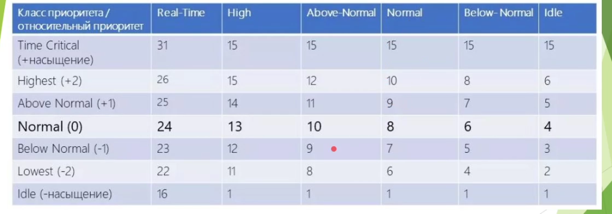

# 8. Синхронизация, механизмы синхронизации.
##### 8
[Наверх](#table-of-contents)

Синхронизация процессов — приведение двух или нескольких процессов к такому их протеканию, когда определённые стадии разных процессов совершаются в определённом порядке, либо одновременно.

Синхронизация необходима в любых случаях, когда параллельно протекающим процессам необходимо взаимодействовать. Для её организации используются средства межпроцессного взаимодействия. Среди наиболее часто используемых средств — сигналы и сообщения, семафоры и мьютексы, каналы (англ. pipe), совместно используемая память.

Механизмами синхронизации являются средства операционной системы, которые помогают решать основную задачу синхронизации - обеспечивать координацию потоков, которые работают с совместно используемыми данными. Такие средства являются минимальными блоками для построения многопоточных программ, их называют синхронизационными механизмами.

* Механизмы синхронизации
    * Interlock-функции
    * Спин-блокировка
    * Ожидаемый таймер
    * Семафор
    * Взаимоисключение (мьютекс)
    * Критическая секция
    * Событие

Семафор - это совместно используемый неотъемлемый целочисленный счетчик, для которого задано начальное значение и определены следующие атомарные операции.
* Уменьшение семафора (down): если значение семафора больше нуля, его уменьшают на единицу, если же значение равно нулю, этот поток переходит в состояние ожидания до тех пор, пока оно не станет больше нуля. Эту операцию называют также ожиданиям - wait;
* Увеличение семафора (up): значение семафора увеличивается на единицу; когда при этом есть потоки, которые ожидают на семафоре, один из них выходит из ожидания и выполняет свою операцию уменьшения. Если на семафоре ожидают несколько потоков, то вследствие выполнения операции увеличения, его значение остается нулевым, но один из потоков продолжает выполнение. Эту операцию также называют сигнализацией - post.

Фактически значение семафора определяет количество потоков, которое может пройти через этот семафор без блокировки. Когда для семафора задано нулевое начальное значение, то он будет блокировать все потоки до тех пор, пока какой-то поток его не "откроет", выполнив операцию up. Операции up и down могут быть выполнены любыми потоками, имеющих доступ к семафору.

Мьютекс - реализует взаимное исключение. Его основная задача - блокировать все потоки, которые пытаются получить доступ к коду, когда этот код уже выполняет некоторый поток.
Мьютекс может находиться в двух состояниях: свободном и занятом. Начальным состоянием является «свободный». Над мьютекс возможны две атомарные операции.
* Занять мьютекс: если мьютекс был свободен, он становится занятым, и поток продолжает свое выполнение; если мьютекс был занят, поток переходит в состояние ожидания, выполнение продолжает другой поток. Поток, который занял мьютекс, называют владельцем мьютекс;
* Освободить мьютекс: мьютекс становится свободным; если на нем ожидают несколько потоков, из них выбирают один, он начинает выполняться, занимает мьютекс и входит в критическую секцию. В большинстве реализаций выбор потока будет случайным. Освободить мьютекс может только его владелец.

Правила упрощенного параллелизма предназначены для упрощения программирования на базе мьютексов. Они основываются на том очевидном факте, что мьютекс защищает не код критической секции, а совместно используемые данные внутри этой секции. Особенности работы упрощенного параллелизма:
* Каждая переменная, которую совместно использует более одного поток, должна быть защищена отдельным мьютексом;
* Перед каждой операцией изменения такой переменной, соответствующий мьютекс должен быть занят, а после изменения освобожден;
* Если надо работать одновременно с несколькими совместно используемыми переменными, необходимо занять все их мьютексы до начала работы и освободить их только после полного окончания работы.

Рекурсивный мьютекс - особый вид мьютекса. Он позволяет повторное занятие тем же потоком, а также отслеживает, какой поток пытается его занять.

Когда это не тот поток, который уже занимает, мьютекс ведет себя как обычный, и поток переходит в состояние ожидания. Когда же это тот самый поток, внутренний счетчик блокировок этого мьютекс увеличивают на единицу, и поток продолжает свое выполнение. В случае увольнения мьютекс внутренний счетчик уменьшается на единицу, для других потоков рекурсивный мьютекс будет разблокирован только тогда, когда счетчик дойдет до нуля (то есть, когда все его блокировки одним потоком будут сняты).

Рекурсивные мьютексы менее эффективны в реализации, не могут быть использованы вместе с условными переменными, поэтому обращаться к ним нужно только тогда, когда без этого нельзя обойтись. Например, библиотека функций может использовать такие мьютексы для того, чтобы избежать взаимных блокировок при повторном вызове таких функций одним потоком.

Условной переменной называют синхронизационные примитивы, позволяющие организовать ожидания выполнения условия внутри критической секции, заданной мьютексом. Условная переменная всегда связана с конкретным мьютексом и данными, защищенными этим мьютексом. Для условной переменной определены следующие операции:
1.	Ожидания (wait). Дополнительным входным параметром эта операция принимает мьютекс, который должен находиться в закрытом состоянии. Вызов ожидания происходит в ситуации, когда не выполняется некоторое условие и нужны потоки для продолжения работы. Вследствие выполнения ожидания поток прекращается, а мьютекс открывается. Так другие потоки получают возможность войти в критическую секцию и изменить там данные, которые она защищает, возможно, выполнив условие, необходимое потоку. На этом операция ожидания не заканчивается - ее завершит другой поток, вызвав операцию сигнализации после того, как условие будет выполнено.
2.	Сигнализация (signal). Эту операцию поток должен выполнить после того, как войдет в критическую секцию и завершит работу с данными. Эта операция проверяет, нет ли потоков, ожидающих условной переменной, и если такие потоки есть, переводит один из них в состояние готовности. В результате восстановления поток завершает выполнение операции ожидания и блокирует мьютекс. Если нет ни одного потока, который ожидает условной переменной, операция сигнализирования не делает ничего, и информацию о ее выполнении в системе не сохраняют.
3.	Широковещательная сигнализация (broadcast) отличается от обычной тем, что перевод в состояние готовности и восстановление выполняют для всех потоков, ожидающих этой условной переменной, а не только для одного из них.

# 9. Виртуальное адресное пространство процесса.
##### 9
[Наверх](#table-of-contents)

Виртуальным адресным пространством для процесса является набор адресов виртуальной памяти, который процесс может использовать. Адресное пространство для каждого процесса является закрытым и не может быть доступно другим процессам, если он не является общим.

Виртуальный адрес не представляет фактическое физическое расположение объекта в памяти; Вместо этого система ведет таблицу страниц для каждого процесса, который представляет собой внутреннюю структуру данных, используемую для преобразования виртуальных адресов в соответствующие физические адреса. Каждый раз, когда поток ссылается на адрес, система преобразует виртуальный адрес в физический адрес.

Виртуальное адресное пространство для 32-разрядного Windows имеет размер 4 гигабайта (гб) и делится на две секции: одна для использования процессом, а другая зарезервирована для 
использования системой.

В верхней части адресного пространства процесса спроецированы важные системные библиотеки (например, библиотеки user, kernel, gdi и другие компоненты Windows API), таким образом любой процесс может их использовать. Само обращение идет в пространство ядра, адреса в процессе - переходник.

### Windows x64
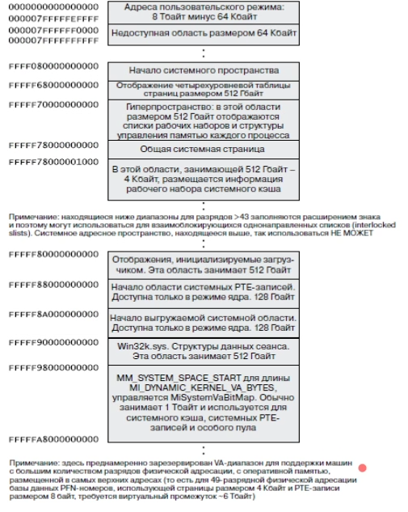
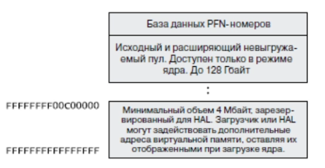

### Windows x32

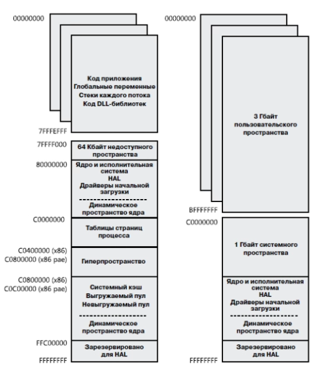

HAL - структуры, находящиеся в верхней части адресного пространства процесса. Это уровень аппаратных абстракций, компонент операционной системы, отвечающий за аппаратно-зависимые функции (работа портов, работа с разными процессорами, разной адресацией).

 ## Unix

 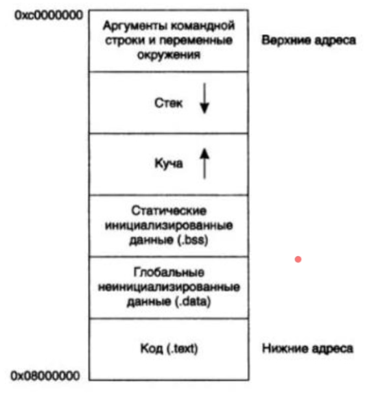
 
 3ГБ занимает пространство пользовательского режима. Верхний гигабайт занят проекций кода и структур операционной системы. В пользовательской части адресного пространство непосредственно находится исполняемый код программы, это образ программы в памяти.

Секция глобальных данных - размещение глобальных переменных, локальные же размещаются в стеках своих потоков. Эта область доступна всем потокам в процессе, также там находятся неинициализированные переменные.

В одном пространстве размещаются стеки потоков, в другом кучи или области динамической памяти, представляют собой большую область пространства пользователя. Стеки могут увеличиваться, если это требуется. Куча также имеет динамический размер, который зависит от выделения или освобождения динамической памяти. 

## Работа с памятью на прикладном уровне

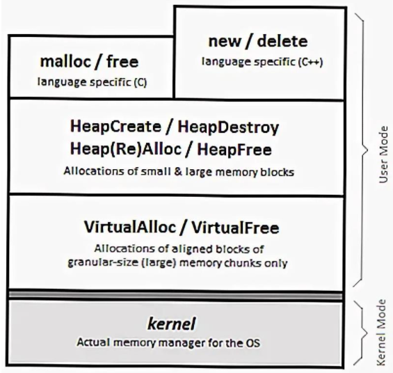

Существуют динамичиское распределение памяти, которые выполняется компилятором языка программирования. Существует два основных метода:
* Использование функциий языка (malloc calloc realloc, free / new, delete). Программист отвечает за выделение и освобождение памяти. Операторы new и delete имеют дополнительные возможности вызова конструктора и деструктора соответственно, в отличии от ф-н семейства malloc.
* Использование API операционной системы (HeapCreate, HeapDestroy HeapDestroy, Heap(Re)Alloc, HeapFree). Предоставляют дополнительные функции, которые отсутствуют в функциях языка. Можно выделять страничные пулы.

Преимущество использование API - можно создать несколько куч, по умолчанию создается только одна, стандартная куча процесса.

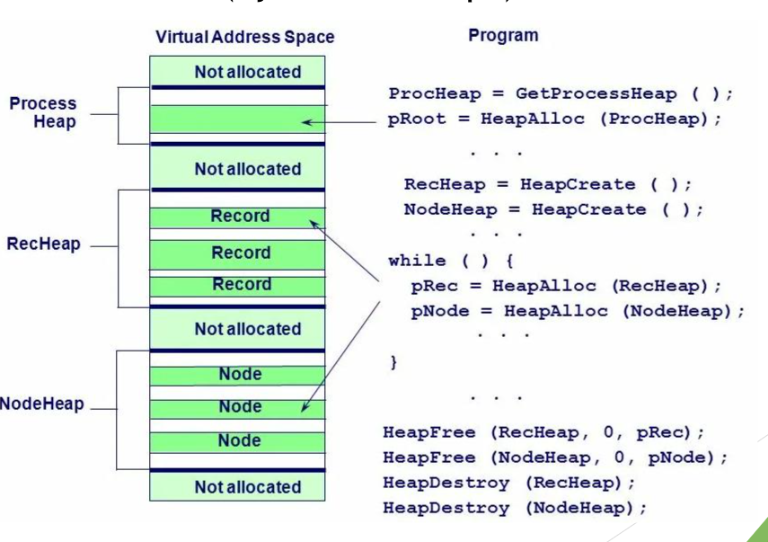

# 10. Страничная адресация и работа файла подкачки.
##### 10
[Наверх](#table-of-contents)

Это один из вариантов организации адресного пространства.

Страничная адресация памяти представляет собой механизм управления памятью, позволяющий разрешить задачу повышения эффективности процессов обмена информацией между уровнями иерархической памяти.

Основная идея страничной адресации состоит в разбиении всей памяти на блоки одинаковой длины, называемые страницами. Размер страниц обычно равен целой степени 2 (например, 4K или 1M).

Линейный адрес может не совпадать с физическим адресом, эту страничную трансляцию выполняет блок управления памятью (диспетчер памяти в ЦПУ).

Преимущества:
* При этом для программиста память остается линейной, хотя линейные адреса могут быть разбросаны по разным физическим адресам.
* Легче избавиться от фрагментации памяти.
* Виртуальная память дешевая, можно выделять гигабайты памяти, однако пока они не используются, реальной взаимосвязи с физической памяти нет. Т.е. резервирование не связывает с физическими страницами.
* Страничная трансляция не совпадает с физическими, поэтому программы изолированы друг от друга. (хотя есть исключение CopyOnWrite)
* OS в том числе защищает саму себя.

Используется специальная структура - страничный каталог. Линейный адрес состоит из 3 частей : [10 бит, Индекс каталога][10, Индекс страницы][12, Смещение]. 12 бит - 4 Кб - размер страницы.

Страничный каталог > Таблица страниц > Страничный блок. Эти каталоги постоянно обновляются, этим занимается OS. 

Страничная подкачка позволяет использовать больше памяти, чем есть с помощью трансляции адресов на адреса на жестком диске.

## Решаемые задачи
* поддержка изоляции процессов и защиты памяти путём создания своего собственного виртуального адресного пространства для каждого процесса
* поддержка изоляции области ядра от кода пользовательского режима
* поддержка памяти «только для чтения» и неисполняемой памяти
* поддержка отгрузки давно не используемых страниц в область подкачки на диске (см. свопинг)
* поддержка отображённых в память файлов, в том числе загрузочных модулей
* поддержка разделяемой между процессами памяти, в том числе с копированием-по-записи для экономии физических страниц
* поддержка системного вызова fork() в ОС семейства UNIX

## Концепции 
Адрес, используемый в машинном коде, то есть значение указателя, называется «виртуальный адрес».

Адрес, выставляемый процессором на шину, называется «линейный адрес» (который позже преобразуется в физический).

Запись таблицы страниц обычно содержит в себе следующую информацию:

* флаг «страница отображена»
* физический адрес
* флаг «страница доступна из режима пользователя». При неустановке данного флага страница доступна только из режима ядра.
* флаг «страница доступна только на чтение». В некоторых случаях используется только для режима пользователя, то есть в режиме ядра все страницы всегда доступны на запись.
* флаг «страница недоступна на исполнение».
режим использования кэша для страницы. Влияет на тип шинных транзакций, инициируемых процессором при обращении через данную запись. Особенно часто используется для видеопамяти (комбинированная запись) и для отображенных в память регистров устройств (полное отсутствие кэширования).

## Файл подкачки
Оперативная память — это ограниченный ресурс, в то время как для большинства практических целей виртуальная память не ограничена. Может быть много процессов, и каждый процесс имеет свои собственные 2 ГБ частного виртуального адресного пространства. Если память, используемая всеми существующими процессами, превышает доступную оперативную память, операционная система перемещает страницы (4-КБ частей) одного или более виртуальных адресных пространств на жесткий диск компьютера. Это освободит раму оперативной памяти для других применений. В Windows системах указанные страницы хранятся в одном или Pagefile.sys файлах в корне раздела. В каждом разделе диска может быть один такой файл..

Пользователи часто задают вопрос о том, насколько большим должен быть этот pagefile? На этот вопрос нет единого ответа, так как он зависит от количества установленной оперативной памяти и от объема виртуальной памяти, требуемой рабочей нагрузкой. Если других сведений нет, то обычная рекомендация в 1,5 раза больше установленной оперативной памяти является хорошей отправной точкой. В серверных системах обычно необходимо иметь достаточно оперативной памяти, чтобы не было недостатка и чтобы не использовался pagefile. В этих системах это может не служить никакой полезной цели для поддержания большого pagefile. С другой стороны, если дискового пространства достаточно, сохранение большого pagefile (например, в 1,5 раза больше установленной оперативной памяти) не вызывает проблем, и это также устраняет необходимость беспокоиться о том, насколько большим он должен быть.

# 11. Управление памятью в системах Windows (динамическая память).
##### 11
[Наверх](#table-of-contents)

см 9.

Память является важнейшим ресурсом, требующим тщательного управления со стороны мультипрограммной операционной системы. Распределению подлежит вся оперативная память, не занятая операционной системой. Обычно ОС располагается в самых младших адресах, однако может занимать и самые старшие адреса. Функциями ОС по управлению памятью являются: отслеживание свободной и занятой памяти, выделение памяти процессам и освобождение памяти при завершении процессов, вытеснение процессов из оперативной памяти на диск, когда размеры основной памяти не достаточны для размещения в ней всех процессов, и возвращение их в оперативную память, когда в ней освобождается место, а также настройка адресов программы на конкретную область физической памяти.

* Операционная система решает следующие задачи:
    * Отслеживание свободной и занятой памяти.
    * Выделение и освобождение памяти по запросам процессов.
    * Обеспечение настройки адресов.
    * Поддержка механизма виртуальной памяти

Динамическое распределение памяти — способ выделения оперативной памяти компьютера для объектов в программе, при котором выделение памяти под объект осуществляется во время выполнения программы.

При динамическом распределении памяти объекты размещаются в т. н. «куче» (англ. heap): при конструировании объекта указывается размер запрашиваемой под объект памяти, и, в случае успеха, выделенная область памяти, условно говоря, «изымается» из «кучи», становясь недоступной при последующих операциях выделения памяти. Противоположная по смыслу операция — освобождение занятой ранее под какой-либо объект памяти: освобождаемая память, также условно говоря, возвращается в «кучу» и становится доступной при дальнейших операциях выделения памяти.

По мере создания в программе новых объектов количество доступной памяти уменьшается. Отсюда вытекает необходимость постоянно освобождать ранее выделенную память. В идеальной ситуации программа должна полностью освободить всю память, которая потребовалась для работы. По аналогии с этим, каждая подпрограмма (процедура или функция) должна обеспечить освобождение всей памяти, выделенной в ходе её выполнения. Неправильное управление памятью приводит к т.н. «утечкам» памяти, когда выделенная память не освобождается. Многократные утечки памяти могут привести к исчерпанию всей оперативной памяти и нарушить работу операционной системы.

Другая проблема — это проблема фрагментации памяти. Выделение памяти происходит блоками — непрерывными фрагментами оперативной памяти (таким образом, каждый блок — это несколько идущих подряд байт). В какой-то момент в куче попросту может не оказаться блока подходящего размера и, даже если свободная память достаточна для размещения объекта, операция выделения памяти окончится неудачей.

Для управления динамическим распределением памяти используется «сборщик мусора» — программный объект, который следит за выделением памяти и обеспечивает её своевременное освобождение. Сборщик мусора также следит за тем, чтобы свободные блоки имели максимальный размер, и, при необходимости, осуществляет дефрагментацию памяти.

Преимущество динамически распределяемой памяти в том, что она позволяет Вам игнорировать гранулярность выделения памяти и размер страниц и сосредоточиться непосредственно на своей задаче. А недостаток — выделение и освобождение блоков памяти проходит медленнее, чем при использовании других механизмов, и, кроме того, Вы теряете прямой контроль над передачей физической памяти и ее возвратом системе.

Куча — это регион зарезервированного адресного пространства. Первоначально большей его части физическая память не передается. По мере того, как программа занимает эту область под данные, специальный диспетчер, управляющий кучами (heap manager), постранично передаст ей физическую память (из страничного файла). А при освобождении блоков в куче диспетчер возвращает системе соответствующие страницы физической памяти.

# 12. Библиотеки динамической компоновки DLL.
##### 12
[Наверх](#table-of-contents)

Применение библиотек динамической компоновки на практике подразумевает наличие в них специальных функций, которые могут быть вызваны из других приложений или DLL. Такие функции называются экспортируемыми. Вызывающее приложение определенным образом получает информацию об адресе и характеристиках экспортируемой функции (импортирует функцию), а затем осуществляет собственно ее вызов с передачей соответствующих параметров. Таким образом, приложение получает возможность задействовать все преимущества, которые дает применение библиотек динамической компоновки при разработке программного обеспечения. 

Как правило, типичная DLL содержит некоторое количество внутренних функций, выполняющих реальную работу, а также несколько экспортируемых функций, которые играют роль интерфейса между DLL и приложениями. При этом экспортируемые функции могут вызывать внутренние функции DLL, что, вообще говоря, является хорошей практикой, так как обеспечивает инкапсуляцию и высокую степень внутренней связности в DLL. 

Стандартной точкой входа для DLL, т.е. аналогом WinMain для приложений является функция DllEntryPoint() (еще она может называться DllMain() ).  Она применяется достаточно редко – как правило, в случаях, когда требуется выполнять какие-то инициализационные действия при загрузке DLL, поскольку в этом случае DllEntryPoint() вызывается автоматически. Тем не менее, DllEntryPoint() является обязательным элементом библиотеки DLL, хотя и содержит обычно только оператор выхода. 

Функция GetSomeString() является внутренней функцией DLL и не экспортируется.   Таким образом, другие приложения не имеют прямого доступа к ее коду. В приведенном примере функция GetSomeString() выполняет некоторую полезную работу, т.е. возвращает определенную строку, которая используется вызывающим приложением.

Функция Test() является экспортируемой, т.е. она доступна другим приложениям. Для этого она должна быть описана со специальным модификатором, который   определяется используемой версией компилятора (в приведенном примере   __declspec (dllexport)). При использовании этого модификатора информация о функции будет помещена в таблицу экспорта DLL и станет доступна внешним приложениям. 

Таким образом, после успешной сборки DLL и заполнения таблицы экспорта внешние приложения смогут вызывать функцию Test() и, соответственно,  получать в свое распоряжение строку, возвращаемую функцией GetSomeString(), т.е. задействовать функционал, предоставляемый библиотекой DLL.

# 13. Явное и неявное связывание библиотек динамической компоновки.
##### 13
[Наверх](#table-of-contents)

Вызов функций из DLL существенно отличается в зависимости от того, применяется неявное или явное связывание библиотеки DLL с приложением. При неявном связывании информация о вызываемой функции и библиотеке DLL, в которой она реализована, помещается в таблицу импорта вызывающего приложения, и оно получает всю необходимую информацию для вызова функции. Это действие выполняется на этапе компоновки приложения с помощью т.н. библиотеки импорта. Такая библиотека создается с помощью   специальной утилиты LIB. Полученная библиотека импорта   содержит сведения о функциях, экспортируемых из DLL. Таким образом, она   является посредником между DLL, которая экспортирует функции, и EXE-файлом, который эти функции использует.  

Поскольку вызываемая из DLL функция является внешней по отношению к вызывающему приложению, она должна обязательно иметь прототип в вызывающей программе, определенный в точном соответствии с его описанием в DLL.   При этом прототип обязательно должен иметь модификатор extern, показывающий, что функция является внешней   по отношению к данному модулю, и ее код следует искать где-то во внешних   модулях (в данном случае в DLL). 

Как видно, приложение содержит прототип функции Test(), совпадающий  с ее описанием в коде библиотеки DLL (за исключением модификатора __declspec (dllexport)), и имеющий модификатор extern. Это дает возможность при компоновке с использованием соответствующей библиотеки импорта напрямую осуществлять вызов функции DLL, неявно связанной с приложением, как показано в коде функции WinMain(). 

Данная схема вызова удобна тем, что не требует от программиста никаких дополнительных усилий для связи с DLL и вызова нужной функции. 

При явном связывании вызов функции осуществляется иначе и требует от программиста следующих явных действий:  
* загрузка DLL (через LoadLibrary()) 
* получение адреса нужной функции (через GetProcAddress()) 
* выгрузка DLL (через FreeLibrary())  

Как видно, вызов функции при явном связывании осуществляется значительно сложнее и требует, в частности, иного описания функции в самой библиотеке DLL.  

Наличие в описании модификатора extern “C” продиктовано особенностями явного связывания, согласно которым вызывающей программе   должно быть известно внутреннее имя функции в DLL. Дело в том, что компиляторы С++ используют   т.н. расширение имен (name mangling), предназначенное для поддержки   перегруженных функций. При расширении имен внутреннее имя функции отличается   от имени в тексте программы, поскольку к нему дописываются специальные   символы расширения. Таким образом, попытка вызвать функцию из DLL по имени   будет неудачной (имя функции, переданное вызывающим приложением, и внутреннее имя функции будут отличаться). Один из способов обхода данной проблемы – это отключение расширения имен, которое достигается с использованием специального модификатора extern “C”. В этом случае внутреннее имя функции будет совпадать с именем функции в коде вызывающего приложения. 

Вызывающее приложение определяет указатель на функцию, имеющую тот же тип, что и функция Test(), которая в этом примере вызывается из DLL. Это необходимо, так как вызов функции при явном связывании происходит по ее указателю. Для удобства дальнейшего использования создается тип такого указателя, имеющий имя PFN. 

Для вызова функции Test() из DLL вызывающее приложение вначале должно загрузить библиотеку DLL, содержащую эту функцию, в адресное пространство процесса, что осуществляется посредством функции WinAPI LoadLibrary() как показано в приведенном примере. При этом в переменной hMod сохраняется дескриптор модуля DLL, загруженной в адресное пространство процесса.  

Далее посредством вызова функции WinAPI GetProcAddress() выполняется получение адреса функции Test() внутри модуля DLL, ранее загруженной в процесс вызывающего приложения. Полученный адрес приводится к ранее определенному типу PFN. Так как теперь известен адрес функции Test(), то выполняется ее фактический вызов, в результате которого в переменную str возвращается строка, представляющая собой результат выполнения функций из библиотеки DLL. Данная строка выводится в MessageBox, на чем использование функционала DLL приложением и завершается. Так как теперь ранее загруженная DLL более не требуется, то происходит ее выгрузка из адресного пространства процесса вызывающего приложения посредством функции WinAPI FreeLibrary(), после чего вызывающее приложение завершает работу.                               Следует особо отметить, что явное связывание при больших усилиях, связанных с вызовом функций из DLL, обеспечивает значительную гибкость и лучший контроль со стороны программиста, чем неявное связывание.   

# 14. Организация дискового пространства.
##### 14
[Наверх](#table-of-contents)

Жесткий диск (НDD — Hard Disk Drive) устроен следующим образом: на шпинделе, соединенным с электромотором, расположен блок из нескольких дисков (блинов), над поверхностью которых находятся головки для чтения/записи информации. Форма головкам придается в виде крыла и крепятся они на серпообразный поводок. При работе они «летят» над поверхностью дисков в воздушном потоке, который создается при вращении этих же дисков. Диск разбит на дорожки (или треки), которые в свою очередь поделены на сектора. Две дорожки, равноудаленные от центра, но расположенные по разные стороны диска, называются цилиндрами.

Все пространство диска разбивается на дорожки в виде концентрических окружностей, которые в свою очередь разделяются на секторы. Для их создания используется специальная процедура, которая называется форматированием и выполняется с помощью средств операционной системы (например, в MS DOS это команда FORMAT). Фактически при этом осуществляются две различные операции, называемые форматированием низкого и высокого уровней. Низкоуровневое (физическое) форматирование состоит в нанесении на диск электронных меток для обозначения дорожек и секторов. При форматировании высокого уровня (его называют также логическим) осуществляется создание служебных областей на диске.

Перед использованием магнитный диск обязательно должен быть отформатирован. Программа форматирования проверяет также работоспособность диска, отсутствие ошибок при записи и считывании информации. Дефектные секторы специальным образом помечаются и в дальнейшем не используются. Если диск уже форматировался ранее и на нем записана какая-то информация, то повторная процедура форматирования полностью уничтожает ее.

В первом физическом секторе жесткого диска располагается главная загрузочная запись (master boot record, MBR) и таблица разделов диска. MBR при загрузке с жесткого диска считывает и загружает в память первый физический сектор на активном разделе диска, называемый загрузочным сектором (boot sector). Каждая запись в таблице разделов (partition table) содержит начальную позицию и размер каждого раздела на жестком диске, а также информацию о том, первый сектор какого раздела содержит загрузочную запись.

Базовой единицей физического сектора жесткого диска является раздел, создаваемый во время разметки жесткого диска и обслуживаемый какой-либо файловой системой. Некоторые операционные системы поддерживают создание томов, охватывающих несколько разделов.

Жесткий диск может содержать до четырех основных разделов. Это ограничение связано с характером организации данных на жестких дисках IBM-совместимых компьютеров. Многие операционные системы позволяют создавать так называемый расширенный (extended) раздел, который по аналогии с основным разделом может разбиваться на несколько логических дисков.

# 15. Организация файловой системы FAT32. 
##### 15
[Наверх](#table-of-contents)

Файловая систе́ма (англ. file system) — порядок, определяющий способ организации, хранения и именования данных на носителях информации в компьютерах. Файловая система определяет формат содержимого и способ физического хранения информации, которую принято группировать в виде файлов. Конкретная файловая система определяет размер имен файлов (и каталогов), максимальный возможный размер файла и раздела, набор атрибутов файла. Некоторые файловые системы предоставляют сервисные возможности, например, разграничение доступа или шифрование файлов.

Файловая система связывает носитель информации с одной стороны и API для доступа к файлам — с другой. Когда прикладная программа обращается к файлу, она не имеет никакого представления о том, каким образом расположена информация в конкретном файле, так же как и о том, на каком физическом типе носителя он записан. Всё, что знает программа — это имя файла, его размер и атрибуты. Эти данные она получает от драйвера файловой системы. Именно файловая система устанавливает, где и как будет записан файл на физическом носителе (например, жёстком диске).
    
FAT (File Allocation Table – таблица размещения файлов) – классическая архитектура файловой системы, которая из-за своей простоты всё ещё широко используется для флеш-дисков и карт памяти. В недавнем прошлом использовалась в дискетах, на жёстких дисках и других носителях информации.

Существует четыре версии FAT — FAT12, FAT16, FAT32 и exFAT (FAT64). Они отличаются разрядностью записей в дисковой структуре, то есть количеством бит, отведённых для хранения номера кластера

FAT32 — предпоследняя (перед FAT64, также известной как exFAT) версия файловой системы FAT и улучшение предыдущей версии, известной как FAT16. Она была создана, чтобы преодолеть ограничения на размер тома в FAT16, позволяя при этом использовать старый код программ MS-DOS и сохранив формат. FAT32 использует 32-разрядную адресацию кластеров. FAT32 появилась вместе с Windows 95 OSR2. Является самым популярным форматом в мире.

Поскольку система FAT хранит данные о файлах и данные о свободном месте на диске в одной таблице, то операция записи файла, традиционно состоящая из двух этапов (добавление занимаемого блока в перечень занятых и исключение этого же блока из списка свободных), происходит в FAT в одно действие. Благодаря этому система FAT обладает врождённой устойчивостью к сбоям, то есть сбой (например, питания) в момент выполнения операции чтения или записи в большинстве случаев не приведёт к разрушению файловой системы. Однако в данном случае речь идёт именно о целостности файловой системы, а не самих файлов.

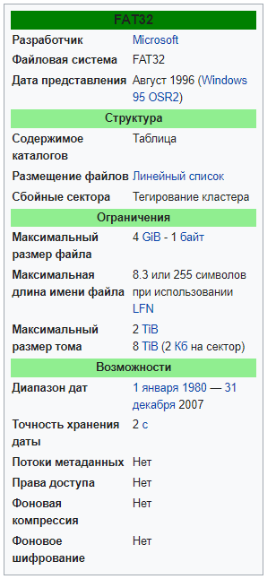

В файловой системе FAT смежные секторы диска объединяются в единицы, называемые кластерами. Количество секторов в кластере равно степени двойки (см. далее). Для хранения данных файла отводится целое число кластеров (минимум один), так что, например, если размер файла составляет 40 байт, а размер кластера 4 Кбайт, реально занят информацией файла будет лишь 1 % отведённого для него места. Во избежание подобных ситуаций целесообразно уменьшать размер кластеров, а для сокращения объёма адресной информации и повышения скорости файловых операций — наоборот. На практике выбирают некоторый компромисс. Так как ёмкость диска вполне может и не выражаться целым числом кластеров, обычно в конце тома присутствуют так называемые surplus sectors — «остаток» размером менее кластера, который не может отводиться ОС для хранения информации.

В файловой системе FAT логическое дисковое пространство любого логического диска делится на две области системную область и область данных.

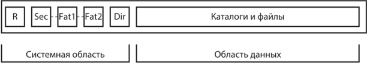

Системная область логического диска создается и инициализируется при форматировании, а впоследствии обновляется при манипулировании файловой структурой. Область данных логического диска содержит файлы и каталоги, подчиненные корневому каталогу. Она, в отличие от системной области, доступна через пользовательский интерфейс. Системная область состоит из следующих компонентов, расположенных в логическом адресном пространстве подряд:

* загрузочной записи (boot record, BR) — содержит программу начальной загрузки операционной системы, которая будет загружаться из этого раздела;
* зарезервированных секторов (reserved sector, Res Sees),
* основной копии таблицы размещения файлов (FAT1) — содержит информацию о размещении файлов и каталогов на диске;
* резервной копии таблицы размещения файлов (FAT2),
* корневого каталога (root directory, RDir) — занимает фиксированную область размером в 32 сектора (16 Кбайт), что позволяет хранить 512 записей о файлах и каталогах, так как каждая запись каталога состоит из 32 байт.

Область данных предназначена для размещения всех файлов и всех каталогов, хранящихся в этом разделе диска, кроме корневого каталога.

## Загрузочная запись

Первая структура тома FAT называется BPB (англ. BIOS parameter block) и расположена в зарезервированной области, в нулевом секторе. Эта структура содержит информацию, идентифицирующую тип файловой системы и физические характеристики носителя (дискеты или раздела на жёстком диске).

## Таблица FAT

Следующая важная структура тома FAT — сама таблица FAT, занимающая отдельную логическую область. Она определяет список (цепочку) кластеров, в которых размещаются файлы и папки тома. Между кластерами и индексными указателями таблицы имеется взаимно однозначное соответствие — N-й указатель соответствует кластеру с тем же номером. Первому кластеру области данных присваивается номер 2. Значение индексного указателя соответствует состоянию соответствующего кластера. Возможны следующие состояния:

* кластер свободен — указатель обнулён;
* кластер занят файлом и не является последним кластером файла — указатель содержит номер следующего кластера файла;
* кластер является последним кластером файла — указатель содержит метку EOC (End Of Clusterchain), значение которой зависит от версии FAT: для FAT32 — любое значение, большее или равное 0x0FFFFFF8 (по умолчанию 0x0FFFFFFF);
* кластер повреждён — указатель содержит специальную метку, значение которой для FAT32 0x0FFFFFF7. Повреждённый кластер не может использоваться файловой системой для хранения данных; соответствующие указатели не затрагиваются при форматировании тома, когда все остальные указатели обнуляются;
* кластер зарезервирован «для будущей стандартизации» — указатель содержит значение, превышающее CountofClusters, но меньшее метки повреждённого кластера (то есть до 0xFFF6 включительно для FAT16). В этом случае кластер, не соответствуя никаким реальным данным, считается занятым и пропускается при поиске свободного, но никакой другой информации о нём не предоставляется.

Кластеры 0 и 1 отражаются FAT особо. Индексный указатель, соответствующий нулевому кластеру (самый первый указатель таблицы FAT), содержит значение BPB_Media в нижних 8 битах; остальные биты устанавливаются в 1. Например, если BPB_Media = 0xF8 (жёсткий диск), FAT[0] = 0x0FFFFFF8 для FAT32. Таким образом, формально FAT[0] = EOC, что используется при обработке файлов нулевого размера (см. далее).

Второй зарезервированный указатель, FAT[1], при форматировании устанавливается в значение метки EOC. В FAT16 и FAT32 верхние два бита этого указателя могут содержать отметку о необходимости проверки тома (так называемый «грязный бит»), причём все остальные биты выставлены в 1. Наличие грязного бита проверяется в процессе загрузки Windows программой autochk.exe. Грязный бит формируется при некорректном отключении тома или при аппаратной ошибке носителя и, соответственно, принимает два возможных значения.

Индексный указатель FAT32 по определению является 32-битным, однако верхние 4 бита в действительности игнорируются, так что значение указателя, по сути, является 28-битным. Единственной операцией, оперирующей с верхними 4 битами указателя, является форматирование тома, когда обнуляется весь указатель. Это означает, что, например, значения указателя 0x10000000, 0xF0000000 и 0x00000000 все соответствуют свободному кластеру, так как они отличаются лишь в верхних 4 битах.

Значение размера таблицы FAT по BPB, то есть BPB_FATSz16/32, может превышать реальное, так что в конце каждой таблицы FAT могут находиться сектора, не соответствующие никаким реальным кластерам данных. При форматировании эти сектора обнуляются, а в процессе функционирования тома никак не используются. Поэтому действительный адрес последнего сектора таблицы FAT, содержащего указатели на реальные кластеры тома, всегда должен рассчитываться из общего количества кластеров области данных, а не из поля BPB_FATSz16/32. Кроме того, последний сектор, занятый таблицей FAT, вовсе не обязательно весь занят ею — в этом случае избыточное пространство сектора также не используется и забивается нулями при форматировании тома.

## Файловые записи

Непосредственно после окончания последней таблицы FAT следует область данных, содержащая файлы и папки. Каталог FAT является обычным файлом, помеченным специальным атрибутом. Данными (содержимым) такого файла в любой версии FAT является цепочка 32-байтовых файловых записей (записей каталога). Каталог не может штатно содержать два файла с одинаковым именем. Если программа проверки диска обнаруживает искусственно созданную пару файлов с идентичным именем в одном каталоге, один из них переименовывается.

### Корневой каталог

Единственным обязательно присутствующим каталогом является корневой каталог. В FAT32 корневой каталог, как и любой другой, имеет переменный размер и является цепочкой кластеров. Номер первого кластера корневого каталога отражается BPB_RootClus. Корневой каталог имеет следующие отличия от других каталогов тома FAT:

* у него нет меток даты и времени;
* нет собственного имени (кроме «\»);
* он не содержит файлов с именами «.» и «..» (см. далее);
* является единственным каталогом, в котором может штатно располагаться файл метки тома (см. далее).

### Структура файловой записи

Файловая запись FAT32 состоит из следующих структур:

* DIR_Name. 11-байтовое поле по относительному адресу 0, содержит короткое имя файла (в рамках стандарта 8.3). По поводу имён файлов см. далее.
* DIR_Attr. Байт по адресу 0x0B, отвечающий за атрибуты файла.
* DIR_NTRes. Байт по адресу 0x0C, используется в Windows NT.
* DIR_CrtTimeTenth. Байт по адресу 0x0D. Счётчик десятков миллисекунд времени создания файла, допустимы значения 0–199. Поле часто неоправданно игнорируется.
* DIR_CrtTime. 2 байта по адресу 0x0E. Время создания файла с точностью до 2 секунд.
* DIR_CrtDate. 2 байта по адресу 0x10. Дата создания файла.
* DIR_LstAccDate. 2 байта по адресу 0x12. Дата последнего доступа к файлу (то есть последнего чтения или записи — в последнем случае приравнивается DIR_WrtDate). Аналогичное поле для времени не предусмотрено.
* DIR_FstClusHI. 2 байта по адресу 0x14. Номер первого кластера файла (старшее слово, на томе FAT12/FAT16 равен нулю).
* DIR_WrtTime. 2 байта по адресу 0x16. Время последней записи (модификации) файла, например его создания.
* DIR_WrtDate. 2 байта по адресу 0x18. Дата последней записи (модификации) файла, в том числе создания.
* DIR_FstClusLO. 2 байта по адресу 0x1A. Номер первого кластера файла (младшее слово).
* DIR_FileSize. DWORD, содержащий значение размера файла в байтах. Фундаментальное ограничение FAT32 — максимально допустимое значение размера файла составляет 0xFFFFFFFF (то есть 4 Гбайт минус 1 байт).

Если первый байт записи FAT (то есть DIR_Name[0]) содержит 0xE5 или 0x05, это значит, что запись свободна (соответствующий файл был удалён). Ноль в DIR_Name[0] означает, что свободна не только эта запись, но и все следующие записи каталога; Windows не анализирует остаток каталога после обнулённой записи.

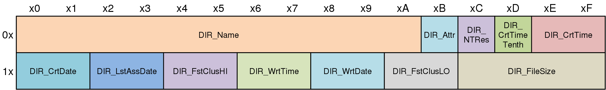

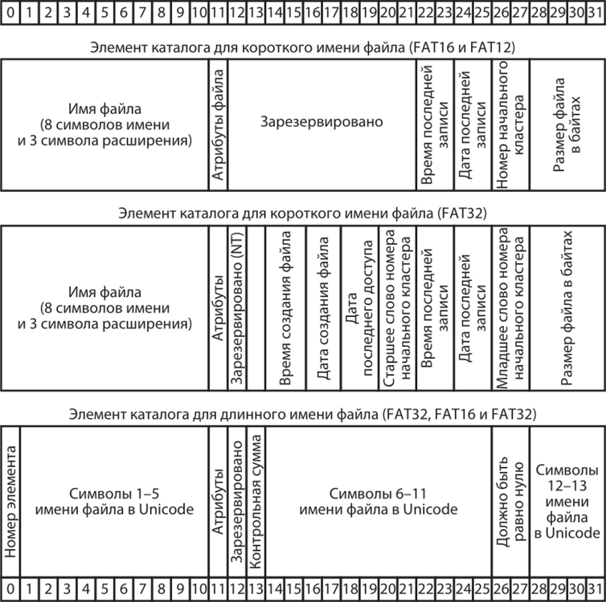

### Имя файла в FAT

Поле DIR_Name логически разбивается на первые 8 символов, образующие имя файла, и последние 3, образующие расширение. Точка-разделитель добавляется на уровне операционной системы и не хранится в поле имени. Если имя и расширение файла не заполняют отведённое для них место, остальные байты поля DIR_Name заполняются пробелами (0x20). Имя и расширение файла могут содержать любую комбинацию букв, цифр или символов с ASCII-кодами свыше 127; специальные символы распределяются на три группы:

* Разрешённые: ! # $ % & () - @ ^ _ ` { } ~ '
* Запрещённые: +.; = [ ]
* Служебные: * ? <: > / \ | "

Служебные символы имеют особое значение в DOS и Windows и не могут входить в состав имени файла (знаки * ? являются метасимволами, а знаки : / \ используются как разделители в путях к файлам, остальные служебные и запрещённые знаки являются управляющими в интерпретаторах командной строки COMMAND.COM и cmd.exe), в то время как символы из числа запрещённых всё же можно включить в имя файла ценой возникновения LFN-записи (см. ниже). Например, каталог с именем, начинающимся точкой или содержащим несколько точек, можно создать в режиме командной строки (mkdir .directory) или в оболочках вроде FAR Manager, Total Commander, WinRAR. Имя файла не может начинаться или заканчиваться пробелом; ни в каком байте поля имени недопустимы управляющие символы ASCII (то есть 0х00-0х1F), за исключением оговорённого выше случая кода 5. Информация о текущей (на момент создания файла) кодовой странице DOS не сохраняется, поэтому доступ к файлам, в именах которых есть национальные коды из Extended ASCII (например знаки кириллицы из кодовой страницы 866), при другой кодовой странице может быть проблематичным или невозможным (поскольку перед поиском файла в каталоге его имя переводится в верхний регистр в соответствии с таблицей, заложенной в кодовой странице). Полный путь к файлу не может превышать 80 байт (3 — буква диска; 64 — путь; 12 — имя файла, включая точку-разделитель; 1 — терминальный нулевой знак).

Все буквенные символы 8.3 имени всегда переводятся и сохраняются в поле DIR_Name в верхнем регистре. Для сохранения исходного регистра имени Windows NT используется байт DIR_NTRes: 1 в бите 3 говорит, что имя следует отображать в нижнем регистре; за расширение отвечает бит 4. Если имя или расширение содержат символы обоих регистров, для такого файла создаётся LFN-запись (см. ниже). Windows 9x для сохранения нетривиального регистра имени всегда создаёт LFN-запись и игнорирует поле DIR_NTRes. Как следствие, имя одного и того же файла, лишённого ассоциированной LFN-записи, может отображаться Windows 9x целиком в верхнем регистре, а Windows NT — (частично) в нижнем.

### Файловые атрибуты

В байте атрибутов верхние два бита являются резервными и всегда должны быть обнулены. Остальные биты распределяются таким образом, что значение 0x01 соответствует атрибуту «только для чтения», 0x02 — «скрытый», 0x04 — «системный», 0x20 — «архивный». Набор нескольких атрибутов составляется суммированием основных значений. Кроме этих стандартных атрибутов используются следующие: 0x10 — свидетельствует, что файл является каталогом (контейнером для других файлов); 0x08 — ATTR_VOLUME_ID, специальный атрибут уникального файла нулевого размера в корневом каталоге, имя которого считается меткой тома. Ограничение длины метки тома FAT в 11 символов связано с размером поля DIR_Name. Если файл имеет набор атрибутов READ_ONLY | HIDDEN | SYSTEM | VOLUME_ID (значение 0х0F), это свидетельствует, что запись не соответствует отдельному файлу, а содержит часть длинного имени другого файла, не вписывающегося в рамки 8.3 (см. далее).

Искусственное присвоение ненулевого значения верхним двум битам DIR_Attr используется для формирования файлов, которые невозможно удалить или переименовать штатными средствами файловой системы без форматирования. Это полезно, например, при борьбе с вирусами Autorun.inf (программа Panda USB and AutoRun Vaccine). С другой стороны, это же средство могут использовать сами вирусы. Значение DIR_Attr = 0x40 резервировано для внутреннего использования (устройство).

### Что происходит при создании каталога

При создании каталога для него «пожизненно» выставляется DIR_FileSize = 0. Размер содержимого каталога определяется простым следованием по цепочкам кластеров до метки End Of Chain. Размер самого каталога лимитируется файловой системой в 65 535 32-байтовых записей (то есть записи каталога в таблице FAT не могут занимать более 2 Мбайт). Это ограничение призвано ускорить операции с файлами и позволить различным служебным программам использовать 16-битное целое (WORD) для подсчёта количества записей в каталоге (как следствие, возникает теоретическое ограничение на количество файлов в каталоге — 65 535 при условии, что все имена файлов следуют стандарту 8.3). Каталогу отводится один кластер области данных , и полям DIR_FstClusHI / DIR_FstClusLO присваивается значение номера этого кластера. В таблицу FAT для записи, соответствующей этому кластеру, помещается метка EOC, а сам кластер забивается нулями. Далее создаются два специальных файла, без которых каталог FAT считается повреждённым (первые две 32-байтовых записи в области данных кластера) — файлы нулевого размера с именами «.» (одна точка, идентификатор каталога) и «..» (две точки, указатель на родительский каталог). Отметки даты и времени этих файлов приравниваются значениям для самого каталога на момент создания и не обновляются при изменениях каталога. Поля DIR_FstClusHI / DIR_FstClusLO файла «.» содержат значение номера содержащего его кластера, а файла «..» — номера первого кластера каталога, содержащего данный. Таким образом, файл «.» отсылает к самому каталогу, а файл «..» — к начальному кластеру родительского каталога; если родительский каталог — корневой, начальным кластером считается нулевой.

### Время и дата

* Двухбайтовая отметка даты имеет следующий формат:
    * биты 0–4 — день месяца, допускаются значения 1–31;
    * биты 5–8 — месяц года, допускаются значения 1–12;
    * биты 9–15 — год, считая от 1980 года («эпоха MS-DOS»), возможны значения от 0 до 127 включительно, то есть 1980–2107 годы.
* Двухбайтовая отметка времени имеет следующий формат:
    * биты 0–4 — счётчик секунд (по две), допустимы значения 0–29, то есть 0–58 секунд;
    * биты 5–10 — минуты, допустимы значения 0–59;
    * биты 11–15 — часы, допустимы значения 0–23.

Из отметок даты и времени критическим является лишь время последней модификации (то есть DIR_WrtTime и DIR_WrtDate), остальные могут не поддерживаться многими системами; при операциях с файлом в такой системе (например в DOS или Windows 3.1) эти поля игнорируются. FAT сохраняет отметки даты и времени по местному часовому поясу, при его смене отметки не меняются.

Временные отметки каталогов задаются при создании и не изменяются при записи новых файлов в каталог, переименовании или выделении ему нового кластера.

Дата последнего доступа к файлу обновляется при каждом обращении, например при просмотре свойств файла, при перемещении на другой том (но не в пределах тома)..

Дата-время модификации файла изменяется при каждой записи нового содержимого в области данных (не в файловой записи). Другими словами, дата-время модификации не изменяется при смене атрибутов или переименовании файла. Перемещение или копирование файла сохраняет исходную отметку модификации.

Дата и время создания задаётся при выделении файловой записи для нового, не существовавшего до этого файла. Иначе говоря, при переименовании или перемещении файла дата и время создания не изменяются, а при копировании новый файл получает новую отметку. Таким образом, при копировании файла в Windows он может получить более позднюю дату создания, чем дату модификации.

### LFN-записи

Файлы и каталоги с длинным именем (свыше 8.3) обрабатываются файловой системой FAT особым образом. Структура 32-байтовой записи для файла с LFN (Long File Name) отличается от обычной (SFN-записи):

## Смысл файловых операций в FAT

Форматирование тома — таблица индексных указателей обнуляется, за исключением первых трёх (FAT[0] и FAT[1], зарезервированы, а FAT[2] содержит запись, соответствующую файлу метки тома, либо, при отсутствии её — метку EOC) и записей повреждённых кластеров; записи корневого каталога обнуляются (за исключением файла метки тома, если она есть), в остальном область данных не затрагивается.

Удаление файла — первый символ файловой записи и всех ассоциированных LFN-записей заменяется кодом 0xE5; занимаемые файлом кластеры помечаются в таблице FAT как свободные, а в области данных не затрагиваются.

Создание файла или каталога командой «Создать» контекстного меню — создаётся файловая запись для нового «пустого» файла с именем по умолчанию (например «Новая папка») и размером, определяемым типом файла; сам файл, если имеет ненулевой размер (что верно для практически всех «пустых» файлов, кроме каталогов и текстовых документов) записывается в области данных в выделенные ему кластеры; в таблице FAT создаётся соответствующая кластерная цепочка. После присвоения файлу действительного имени (не по умолчанию) первоначально созданная файловая запись помечается как удалённая и создаётся новая.

Переименование файла — создаётся новая запись с обновлённым именем; старая запись помечается как удаленная.

Сохранение файла из приложения (не из командной строки) — создаётся запись, содержащая все поля, кроме размера и начального кластера файла; после завершения сохранения файла создаётся новая запись, содержащая все поля, а прежняя удаляется.

Копирование файла — в новом местоположении создаётся идентичная файловая запись (возможно, за исключением некоторых временных отметок, см. выше), файлу выделяется первый свободный кластер и содержимое файла копируется в новое место, причём происходит копирование текущего кластера, поиск следующего свободного и заполнение таблицы FAT.

Перемещение файла (между разными томами) — копирование с последующим удалением файла из исходного местоположения.

Перемещение файла (в пределах тома) — кластерная цепочка не затрагивается, файловая запись копируется без изменения в новый каталог, после чего удаляется из прежнего.

Поиск свободного кластера по таблице индексных указателей для выделения новому файлу начинается в общем случае не с начала области данных (то есть с кластера 2), а с последнего выделенного какому-либо файлу кластера, номер которого сохраняется в структуре FSInfo. Другими словами, если файлу 1 был отведён кластер 30, а файлу 2 — кластер 31, после чего файл 1 был удалён, то при создании нового файла 3 он, скорее всего, будет физически размещён начиная с кластера 32.

|                            | FAT                                                                                                                                                                                           | FAT32                                                                                                                                | NTFS                                                                                                                                                                                                                                    |
|----------------------------|-----------------------------------------------------------------------------------------------------------------------------------------------------------------------------------------------|--------------------------------------------------------------------------------------------------------------------------------------|-----------------------------------------------------------------------------------------------------------------------------------------------------------------------------------------------------------------------------------------|
| Системы, её поддерживающие | DOS, Windows9Х, NT всех версий                                                                                                                                                                | Windows98, NT5                                                                                                                       | NT4, NT5                                                                                                                                                                                                                                |
| Максимальный размер тома   | 2 Гбайт                                                                                                                                                                                       | практически неограничен                                                                                                              | практически неограничен                                                                                                                                                                                                                 |
| Макс. число файлов на томе | примерно 65 тысяч                                                                                                                                                                             | практически не ограничено                                                                                                            | практически не ограничено                                                                                                                                                                                                               |
| Имя файла                  | с поддержкой длинных имен — 255 символов, системный набор символов                                                                                                                            | с поддержкой длинных имен — 255 символов, системный набор символов                                                                   | 255 символов, любые символы любых алфавитов (65 тысяч разных начертаний)                                                                                                                                                                |
| Возможные атрибуты файла   | Базовый набор                                                                                                                                                                                 | Базовый набор                                                                                                                        | всё, что придет в голову производителям программного обеспечения                                                                                                                                                                        |
| Безопасность               | нет                                                                                                                                                                                           | нет                                                                                                                                  | да (начиная с NT5.0 встроена возможность физически шифровать данные)                                                                                                                                                                    |
| Сжатие                     | нет                                                                                                                                                                                           | нет                                                                                                                                  | да                                                                                                                                                                                                                                      |
| Устойчивость к сбоям       | средняя (система слишком проста и поэтому ломаться особо нечему :))                                                                                                                           | плохая (средства оптимизации по скорости привели к появлению слабых по надежности мест)                                              | полная — автоматическое восстановление системы при любых сбоях (не считая физические ошибки записи, когда пишется одно, а на самом деле записывается другое)                                                                            |
| Экономичность              | минимальная (огромные размеры кластеров на больших дисках)                                                                                                                                    | улучшена за счет уменьшения размеров кластеров                                                                                       | максимальна. Очень эффективная и разнообразная система хранения данных                                                                                                                                                                  |
| Быстродействие             | высокое для малого числа файлов, но быстро уменьшается с появлением большого количества файлов в каталогах. результат — для слабо заполненных дисков — максимальное, для заполненных — плохое | полностью аналогично FAT, но на дисках большого размера (десятки гигабайт) начинаются серьезные проблемы с общей организацией данных | система не очень эффективна для малых и простых разделов (до 1 Гбайт), но работа с огромными массивами данных и внушительными каталогами организована как нельзя более эффективно и очень сильно превосходит по скорости другие системы |
|                            |                                                                                                                                                                                               |                                                                                                                                      |                                                                                                                                                                                                                                         |
|                            |                                                                                                                                                                                               |                                                                                                                                      |                                                                                                                                                                                                                                         |

# 16. Организация файловой системы NTFS.
##### 16
[Наверх](#table-of-contents)

NTFS. — основная файловая система для последних версий Windows и Windows Server — предоставляет полный набор функций, включая дескрипторы безопасности, шифрование, дисковые квоты и расширенные метаданные, а также может использоваться совместно с общими томами кластера (CSV) для предоставления непрерывно доступных томов, доступ к которым возможен одновременно из нескольких узлов отказоустойчивого кластера.

NTFS является простой, но очень мощной разработкой. Для этой перспективной файловой системы вся информация на томе NTFS является файлом или частью файла. Каждый распределенный на томе NTFS сектор принадлежит некоторому файлу. Даже метаданные (metadata) файловой системы (информация, которая описывает непосредственно файловую систему) являются частью файла.

Эта основанная на атрибутах файловая система поддерживает объектно - ориентированные приложения, обрабатывая все файлы как объекты, которые имеют определяемые пользователем и системой атрибуты.

Как и любая другая система, NTFS делит все полезное место на кластеры — блоки данных, используемые единовременно. NTFS поддерживает почти любые размеры кластеров — от 512 байт до 64 Кбайт, неким стандартом же считается кластер размером 4 Кбайт. Никаких аномалий кластерной структуры NTFS не имеет, поэтому на эту, в общем-то, довольно банальную тему, сказать особо нечего.

Диск NTFS условно делится на две части. Первые 12% диска отводятся под так называемую MFT зону — пространство, в которое растет метафайл MFT (об этом ниже). Запись каких-либо данных в эту область невозможна. MFT-зона всегда держится пустой — это делается для того, чтобы самый главный, служебный файл (MFT) не фрагментировался при своем росте. Остальные 88% диска представляют собой обычное пространство для хранения файлов.

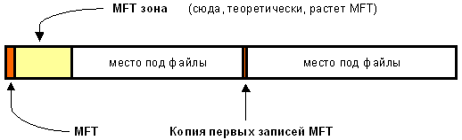

Свободное место диска, однако, включает в себя всё физически свободное место — незаполненные куски MFT-зоны туда тоже включаются. Механизм использования MFT-зоны таков: когда файлы уже нельзя записывать в обычное пространство, MFT-зона просто сокращается (в текущих версиях операционных систем ровно в два раза), освобождая таким образом место для записи файлов. При освобождении места в обычной области MFT зона может снова расширится. При этом не исключена ситуация, когда в этой зоне остались и обычные файлы: никакой аномалии тут нет. Что ж, система старалась оставить её свободной, но ничего не получилось. Жизнь продолжается… Метафайл MFT все-таки может фрагментироваться, хоть это и было бы нежелательно.

## MFT и его структура

Файловая система NTFS представляет собой выдающееся достижение структуризации: каждый элемент системы представляет собой файл — даже служебная информация. Самый главный файл на NTFS называется MFT, или Master File Table — общая таблица файлов. Именно он размещается в MFT зоне и представляет собой централизованный каталог всех остальных файлов диска, и, как не парадоксально, себя самого. MFT поделен на записи фиксированного размера (обычно 1 Кбайт), и каждая запись соответствует какому либо файлу (в общем смысле этого слова). Первые 16 файлов носят служебный характер и недоступны операционной системе — они называются метафайлами, причем самый первый метафайл — сам MFT. Эти первые 16 элементов MFT — единственная часть диска, имеющая фиксированное положение. Интересно, что вторая копия первых четырех записей, для надежности — они очень важны — хранится где-то посередине диска. Остальной MFT-файл может располагаться, как и любой другой файл, в произвольных местах диска — восстановить его положение можно с помощью его самого, «зацепившись» за самую основу — за первый элемент MFT.

Файл $MFTMirr может располагаться не «ровно посредине диска», Его расположение указывается в загрузочном секторе, в самом начале логического диска, раздела.

### Метафайлы

Первые 16 файлов NTFS (метафайлы) носят служебный характер. Каждый из них отвечает за какой-либо аспект работы системы. Преимущество настолько модульного подхода заключается в поразительной гибкости — например, на FAT-е физическое повреждение в самой области FAT фатально для функционирования всего диска, а NTFS может сместить, даже фрагментировать по диску, все свои служебные области, обойдя любые неисправности поверхности — кроме первых 16 элементов MFT.

Метафайлы находятся корневом каталоге NTFS диска — они начинаются с символа имени «$», хотя получить какую-либо информацию о них стандартными средствами сложно. Любопытно, что и для этих файлов указан вполне реальный размер — можно узнать, например, сколько операционная система тратит на каталогизацию всего вашего диска, посмотрев размер файла $MFT. В следующей таблице приведены используемые в данный момент метафайлы и их назначение.

| **Имя метафайла** | Назначение метафайла                                         |
| ----------------- | ------------------------------------------------------------ |
| $MFT              | Сам Master File Table                                        |
| $MFTmirr          | Копия первых 16 записей MFT, размещенная посередине тома     |
| $LogFile          | Файл поддержки операций журналирования                       |
| $Volume           | Служебная информация — метка тома, версия файловой системы и т. д. |
| $AttrDef          | Список стандартных атрибутов файлов на томе                  |
| $.                | Корневой каталог                                             |
| $Bitmap           | Карта свободного места тома                                  |
| $Boot             | Загрузочный сектор (если раздел загрузочный)                 |
| $Quota            | Файл, в котором записаны права пользователей на использование дискового пространства (этот файл начал работать лишь в Windows 2000 с системой NTFS 5.0) |
| $Upcase           | Файл — таблица соответствия заглавных и прописных букв в именах файлов. В NTFS имена файлов записываются в Unicode (что составляет 65 тысяч различных символов) и искать большие и малые эквиваленты в данном случае — нетривиальная задача |

## Файлы и потоки
Итак, у системы есть файлы — и ничего кроме файлов. Что включает в себя это понятие на NTFS?

* Прежде всего, обязательный элемент — запись в MFT, ведь, как было сказано ранее, все файлы диска упоминаются в MFT. В этом месте хранится вся информация о файле, за исключением собственно данных. Имя файла, размер, положение на диске отдельных фрагментов, и т. д. Если для информации не хватает одной записи MFT, то используются несколько, причем не обязательно подряд.
* Опциональный элемент — потоки данных файла. Может показаться странным определение «опциональный», но, тем не менее, ничего странного тут нет. Во-первых, файл может не иметь данных — в таком случае на него не расходуется свободное место самого диска. Во-вторых, файл может иметь не очень большой размер. Тогда идет в ход довольно удачное решение: данные файла хранятся прямо в MFT, в оставшемся от основных данных месте в пределах одной записи MFT. Файлы, занимающие сотни байт, обычно не имеют своего «физического» воплощения в основной файловой области — все данные такого файла хранятся в одном месте — в MFT.

Довольно интересно обстоит дело и с данными файла. Каждый файл на NTFS, в общем-то, имеет несколько абстрактное строение — у него нет как таковых данных, а есть потоки (streams). Один из потоков и носит привычный нам смысл — данные файла. Но большинство атрибутов файла — тоже потоки! Таким образом, получается, что базовая сущность у файла только одна — номер в MFT, а всё остальное опционально. Данная абстракция может использоваться для создания довольно удобных вещей — например, файлу можно «прилепить» еще один поток, записав в него любые данные — например, информацию об авторе и содержании файла, как это сделано в Windows 2000 (самая правая закладка в свойствах файла, просматриваемых из проводника). Интересно, что эти дополнительные потоки не видны стандартными средствами: наблюдаемый размер файла — это лишь размер основного потока, который содержит традиционные данные. Можно, к примеру, иметь файл нулевой длинны, при стирании которого освободится 1 Гбайт свободного места — просто потому, что какая-нибудь хитрая программа или технология прилепила в нему дополнительный поток (альтернативные данные) гигабайтового размера. Но на самом деле в текущий момент потоки практически не используются, так что опасаться подобных ситуаций не следует, хотя гипотетически они возможны. Просто имейте в виду, что файл на NTFS — это более глубокое и глобальное понятие, чем можно себе вообразить просто просматривая каталоги диска. Ну и напоследок: имя файла может содержать любые символы, включая полый набор национальных алфавитов, так как данные представлены в Unicode — 16-битном представлении, которое дает 65535 разных символов. Максимальная длина имени файла — 255 символов.

## Каталоги

Каталог на NTFS представляет собой специфический файл, хранящий ссылки на другие файлы и каталоги, создавая иерархическое строение данных на диске. Файл каталога поделен на блоки, каждый из которых содержит имя файла, базовые атрибуты и ссылку на элемент MFT, который уже предоставляет полную информацию об элементе каталога. Внутренняя структура каталога представляет собой бинарное дерево. Вот что это означает: для поиска файла с данным именем в линейном каталоге, таком, например, как у FAT-а, операционной системе приходится просматривать все элементы каталога, пока она не найдет нужный. Бинарное же дерево располагает имена файлов таким образом, чтобы поиск файла осуществлялся более быстрым способом — с помощью получения двухзначных ответов на вопросы о положении файла. Вопрос, на который бинарное дерево способно дать ответ, таков: в какой группе, относительно данного элемента, находится искомое имя — выше или ниже? Мы начинаем с такого вопроса к среднему элементу, и каждый ответ сужает зону поиска в среднем в два раза. Файлы, скажем, просто отсортированы по алфавиту, и ответ на вопрос осуществляется очевидным способом — сравнением начальных букв. Область поиска, суженная в два раза, начинает исследоваться аналогичным образом, начиная опять же со среднего элемента.

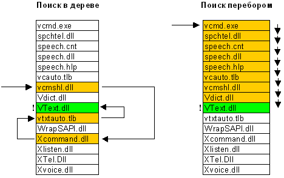

Какую информацию можно получить, просто прочитав файл каталога? Ровно то, что выдает команда dir. Для выполнения простейшей навигации по диску не нужно лазить в MFT за каждым файлом, надо лишь читать самую общую информацию о файлах из файлов каталогов. Главный каталог диска — корневой — ничем не отличается об обычных каталогов, кроме специальной ссылки на него из начала метафайла MFT.

## Журналирование

NTFS — отказоустойчивая система, которая вполне может привести себя в корректное состояние при практически любых реальных сбоях. Любая современная файловая система основана на таком понятии, как транзакция — действие, совершаемое целиком и корректно или не совершаемое вообще. У NTFS просто не бывает промежуточных (ошибочных или некорректных) состояний — квант изменения данных не может быть поделен на до и после сбоя, принося разрушения и путаницу — он либо совершен, либо отменен.

* Пример 1: осуществляется запись данных на диск. Вдруг выясняется, что в то место, куда мы только что решили записать очередную порцию данных, писать не удалось — физическое повреждение поверхности. Поведение NTFS в этом случае довольно логично: транзакция записи откатывается целиком — система осознает, что запись не произведена. Место помечается как сбойное, а данные записываются в другое место — начинается новая транзакция.
* Пример 2: более сложный случай — идет запись данных на диск. Вдруг, бах — отключается питание и система перезагружается. На какой фазе остановилась запись, где есть данные, а где чушь? На помощь приходит другой механизм системы — журнал транзакций. Дело в том, что система, осознав свое желание писать на диск, пометила в метафайле $LogFile это свое состояние. При перезагрузке это файл изучается на предмет наличия незавершенных транзакций, которые были прерваны аварией и результат которых непредсказуем — все эти транзакции отменяются: место, в которое осуществлялась запись, помечается снова как свободное, индексы и элементы MFT приводятся в с состояние, в котором они были до сбоя, и система в целом остается стабильна. Ну а если ошибка произошла при записи в журнал? Тоже ничего страшного: транзакция либо еще и не начиналась (идет только попытка записать намерения её произвести), либо уже закончилась — то есть идет попытка записать, что транзакция на самом деле уже выполнена. В последнем случае при следующей загрузке система сама вполне разберется, что на самом деле всё и так записано корректно, и не обратит внимания на «незаконченную» транзакцию.

И все-таки помните, что журналирование — не абсолютная панацея, а лишь средство существенно сократить число ошибок и сбоев системы. Вряд ли рядовой пользователь NTFS хоть когда-нибудь заметит ошибку системы или вынужден будет запускать chkdsk — опыт показывает, что NTFS восстанавливается в полностью корректное состояние даже при сбоях в очень загруженные дисковой активностью моменты. Вы можете даже оптимизировать диск и в самый разгар этого процесса нажать reset — вероятность потерь данных даже в этом случае будет очень низка. Важно понимать, однако, что система восстановления NTFS гарантирует корректность файловой системы, а не ваших данных. Если вы производили запись на диск и получили аварию — ваши данные могут и не записаться. Чудес не бывает.

## Сжатие

Файлы NTFS имеют один довольно полезный атрибут — «сжатый». Дело в том, что NTFS имеет встроенную поддержку сжатия дисков — то, для чего раньше приходилось использовать Stacker или DoubleSpace. Любой файл или каталог в индивидуальном порядке может хранится на диске в сжатом виде — этот процесс совершенно прозрачен для приложений. Сжатие файлов имеет очень высокую скорость и только одно большое отрицательное свойство — огромная виртуальная фрагментация сжатых файлов, которая, правда, никому особо не мешает. Сжатие осуществляется блоками по 16 кластеров и использует так называемые «виртуальные кластеры» — опять же предельно гибкое решение, позволяющее добиться интересных эффектов — например, половина файла может быть сжата, а половина — нет. Это достигается благодаря тому, что хранение информации о компрессированности определенных фрагментов очень похоже на обычную фрагментацию файлов:

* Физическая раскладка реального несжатого файла:
    * кластеры файла с 1 по 43-й хранятся в кластерах диска начиная с 400-го
    * кластеры файла с 44 по 52-й хранятся в кластерах диска начиная с 8530-го…
* Физическая раскладка типичного сжатого файла:
    * кластеры файла с 1 по 9-й хранятся в кластерах диска начиная с 400-го
    * кластеры файла с 10 по 16-й нигде не хранятся
    * кластеры файла с 17 по 18-й хранятся в кластерах диска начиная с 409-го
    * кластеры файла с 19 по 36-й нигде не хранятся

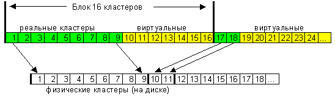

Видно, что сжатый файл имеет «виртуальные» кластеры, реальной информации в которых нет. Как только система видит такие виртуальные кластеры, она тут же понимает, что данные предыдущего блока, кратного 16-ти, должны быть разжаты, а получившиеся данные как раз заполнят виртуальные кластеры — вот, по сути, и весь алгоритм.

|                            | FAT                                                                                                                                                                                           | FAT32                                                                                                                                | NTFS                                                                                                                                                                                                                                    |
|----------------------------|-----------------------------------------------------------------------------------------------------------------------------------------------------------------------------------------------|--------------------------------------------------------------------------------------------------------------------------------------|-----------------------------------------------------------------------------------------------------------------------------------------------------------------------------------------------------------------------------------------|
| Системы, её поддерживающие | DOS, Windows9Х, NT всех версий                                                                                                                                                                | Windows98, NT5                                                                                                                       | NT4, NT5                                                                                                                                                                                                                                |
| Максимальный размер тома   | 2 Гбайт                                                                                                                                                                                       | практически неограничен                                                                                                              | практически неограничен                                                                                                                                                                                                                 |
| Макс. число файлов на томе | примерно 65 тысяч                                                                                                                                                                             | практически не ограничено                                                                                                            | практически не ограничено                                                                                                                                                                                                               |
| Имя файла                  | с поддержкой длинных имен — 255 символов, системный набор символов                                                                                                                            | с поддержкой длинных имен — 255 символов, системный набор символов                                                                   | 255 символов, любые символы любых алфавитов (65 тысяч разных начертаний)                                                                                                                                                                |
| Возможные атрибуты файла   | Базовый набор                                                                                                                                                                                 | Базовый набор                                                                                                                        | всё, что придет в голову производителям программного обеспечения                                                                                                                                                                        |
| Безопасность               | нет                                                                                                                                                                                           | нет                                                                                                                                  | да (начиная с NT5.0 встроена возможность физически шифровать данные)                                                                                                                                                                    |
| Сжатие                     | нет                                                                                                                                                                                           | нет                                                                                                                                  | да                                                                                                                                                                                                                                      |
| Устойчивость к сбоям       | средняя (система слишком проста и поэтому ломаться особо нечему :))                                                                                                                           | плохая (средства оптимизации по скорости привели к появлению слабых по надежности мест)                                              | полная — автоматическое восстановление системы при любых сбоях (не считая физические ошибки записи, когда пишется одно, а на самом деле записывается другое)                                                                            |
| Экономичность              | минимальная (огромные размеры кластеров на больших дисках)                                                                                                                                    | улучшена за счет уменьшения размеров кластеров                                                                                       | максимальна. Очень эффективная и разнообразная система хранения данных                                                                                                                                                                  |
| Быстродействие             | высокое для малого числа файлов, но быстро уменьшается с появлением большого количества файлов в каталогах. результат — для слабо заполненных дисков — максимальное, для заполненных — плохое | полностью аналогично FAT, но на дисках большого размера (десятки гигабайт) начинаются серьезные проблемы с общей организацией данных | система не очень эффективна для малых и простых разделов (до 1 Гбайт), но работа с огромными массивами данных и внушительными каталогами организована как нельзя более эффективно и очень сильно превосходит по скорости другие системы |
|                            |                                                                                                                                                                                               |                                                                                                                                      |                                                                                                                                                                                                                                         |
|                            |                                                                                                                                                                                               |                                                                                                                                      |                                                                                                                                                                                                                                         |