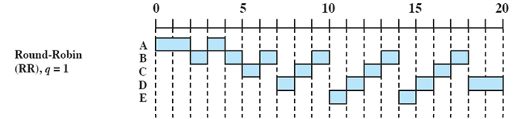

# 1. Назначение и классификация операционных систем.
# 2. Понятие WinAPI и его применение при разработке прикладных программ.
# 3. Процессы и потоки.
# 4. Планирование в системах с одним процессором.
# 5. Планирование в многопроцессорных системах.
# 6. Переключение потоков и краткосрочное планирование.
# 7. Приоритеты процессов и потоков.
# 8. Синхронизация, механизмы синхронизации.
# 9. Виртуальное адресное пространство процесса.
# 10. Страничная адресация и работа файла подкачки.
# 11. Управление памятью в системах Windows (динамическая память).
# 12. Библиотеки динамической компоновки DLL.
# 13. Явное и неявное связывание библиотек динамической компоновки.
# 14. Организация дискового пространства.
# 15. Организация файловой системы FAT32.
# 16. Организация файловой системы NTFS.

# 1. Назначение и классификация операционных систем.

Операционная система — комплекс взаимосвязанных программ, предназначенных для управления ресурсами компьютера и организации взаимодействия с пользователем.
В логической структуре типичной вычислительной системы операционная система занимает положение между устройствами с их микроархитектурой, машинным языком и, возможно, собственными (встроенными) микропрограммами (драйверами) — с одной стороны — и прикладными программами с другой.

## Основные функции:

* Исполнение запросов программ (ввод и вывод данных, запуск и остановка других программ, выделение и освобождение дополнительной памяти и др.).
* Загрузка программ в оперативную память и их выполнение.
* Стандартизованный доступ к периферийным устройствам (устройства ввода-вывода).
* Управление оперативной памятью (распределение между процессами, организация виртуальной памяти).
* Управление доступом к данным на энергонезависимых носителях (таких как жёсткий диск, оптические диски и др.), организованным в той или иной файловой системе.
* Обеспечение пользовательского интерфейса.
* Сохранение информации об ошибках системы.

## Дополнительные функции:

* Параллельное или псевдопараллельное выполнение задач (многозадачность).
* Эффективное распределение ресурсов вычислительной системы между процессами.
* Разграничение доступа различных процессов к ресурсам.
* Организация надёжных вычислений (невозможности одного вычислительного процесса намеренно или по ошибке повлиять на вычисления в другом процессе), основана на разграничении доступа к ресурсам.
* Взаимодействие между процессами: обмен данными, взаимная синхронизация.
* Защита самой системы, а также пользовательских данных и программ от действий пользователей (злонамеренных или по незнанию) или приложений.
* Многопользовательский режим работы и разграничение прав доступа (см.: аутентификация, авторизация).

## Классификация

* По основному назначению: 
    * серверные
    * пользовательские
    * исследовательские (научные)
* По семейству систем: 
    * cистемы семейства Windows, MS-DOS
    * Unix
    * UNIX-подобные системы. (Linux, MacOS, BSD)
* По количеству одновременно работающих пользователей:
    * Однопользовательские ОС позволяют работать на компьютере только одному человеку. (однопользовательские однозадачные – пакетные, MS-DOS, однопользовательские многозадачные – Windows, Linux, Mac OS)
    * Многопользовательские ОС поддерживают одновременную работу на ЭМВ нескольких пользователей за различными терминалами. (многопользовательские многозадачные – сетевые ОС: NetWare, Unix, OS/2, Windows NT)
* По числу процессов, одновременно выполняемых под управлением системы:    
    * Однозадачные ОС поддерживают выполнение только одной программы в отдельный момент времени, то есть позволяют запустить одну программу в основном режиме. (DOS)
    * Многозадачные ОС (мультизадачные) поддерживают параллельное выполнение нескольких программ, существующих в рамках одной вычислительной системы на некотором отрезке времени, то есть позволяют запустить одновременно несколько программ, которые будут работать параллельно, не мешая друг другу.
* По количеству поддерживаемых процессоров (однопроцессорные, многопроцессорные):
    * Многопроцессорные ОС поддерживают режим распределения ресурсов нескольких процессоров для решения той или иной задачи. При многопроцессорном режиме работы два или несколько соединенных и примерно равных по характеристикам процессора совместно выполняют один или несколько процессов (программ или наборов команд). Цель такого режима – увеличение быстродействия или вычислительных возможностей. **Многопроцессорные ОС разделяют на симметричные и асимметричные.**
        * В симметричных ОС на каждом процессоре функционирует одно и то же ядро, и задача может быть выполнена на любом процессоре, то есть обработка полностью децентрализована. При этом каждому из процессоров доступна вся память.
        * В асимметричных ОС процессоры неравноправны. Обычно существует главный процессор (master) и подчиненные (slave), загрузку и характер работы которых определяет главный процессор
* По типу доступа пользователя к ЭВМ:        
    * ОС пакетной обработки: в них из программ, подлежащих выполнению, формируется пакет заданий, вводимых в ЭВМ и выполняемых в порядке очередности с возможным учетом приоритетности.
    * ОС разделения времени обеспечивают одновременный диалоговый (интерактивный) режим доступа к ЭВМ нескольких пользователей на разных терминалах, которым по очереди выделяются ресурсы машины, что координируется операционной системой в соответствии с заданной дисциплиной обслуживания. Каждой программе, находящейся в оперативной памяти и готовой к исполнению, выделяется для исполнения фиксированный, задаваемый в соответствии с приоритетом пользователя интервал времени. Если программа не выполнена до конца за этот интервал, ее исполнение принудительно прерывается, и программа переводится в конец очереди.
    * ОС реального времени обеспечивают определенное гарантированное время ответа машины на запрос пользователя с управлением им какими-либо внешними по отношению к ЭВМ событиями, процессами или объектами. При таком режиме ЭВМ управляет некоторым внешним процессом, обрабатывая данные и информацию, непосредственно поступающую от объекта управления.
* По разрядности кода операционной системы: восьмиразрядные, шестнадцатиразрядные, тридцатидвухразрядные, шестидесяти четырехразрядные.
* По типу интерфейса
    * командные (текстовые)
    * графические

# 2. Понятие WinAPI и его применение при разработке прикладных программ.

**Кратко: API (интерфейс прикладного программирования) упрощает процесс программирования при создании приложений, абстрагируя базовую реализацию и предоставляя только объекты или действия, необходимые разработчику. Windows API предназначен для создания программистами прикладных программ, т.к. система без возможности разрабатывать под нее приложения скорее всего бесполезна. Иначе бы пришлось самим рисовать формочки, читать с жесткого диска и прочее. Называтся он программным интерфейсом, потому что реализует контракт программирования (как что использовать, что вызывать).** 

API (программный интерфейс приложения) (англ. application programming interface) — описание способов (набор классов, процедур, функций, структур или констант), которыми одна компьютерная программа может взаимодействовать с другой программой. Часто реализуется отдельной программной библиотекой или сервисом операционной системы. Используется программистами при написании всевозможных приложений.

Windows API -  общее наименование набора базовых функций интерфейсов программирования приложений операционных систем семейства Windows. Предоставляет прямой способ взаимодействия приложений пользователя с операционной системой Windows. Для создания программ, использующих Windows API, корпорация Майкрософт выпускает комплект разработчика программного обеспечения, который называется Platform SDK и содержит документацию, набор библиотек, утилит и других инструментальных средств для разработки.

Работа через Windows API — это наиболее близкий к операционной системе способ взаимодействия с ней из прикладных программ. Более низкий уровень доступа, необходимый только для драйверов устройств, в текущих версиях Windows предоставляется через Windows Driver Model.

Windows API представляет собой множество функций, структур данных и числовых констант, следующих соглашениям языка Си. В то же время конвенция вызова функций отличается от cdecl, принятой для языка C: Windows API использует stdcall (winapi). Все языки программирования, способные вызывать такие функции и оперировать такими типами данных в программах, исполняемых в среде Windows, могут пользоваться этим API. В частности, это языки C++, C#, Pascal, Visual Basic и многие другие.

Для облегчения программирования под Windows в компании Microsoft и сторонними разработчиками было предпринято множество попыток создать библиотеки и среды программирования, фреймворки (.Net, WinForms, WPF, Qt, Tk). Весомая часть этих библиотек сконцентрирована на облегчении программирования графического интерфейса пользователя.

Все программы, скомпилированные под Windows, так или иначе используют Windows API, поскольку это практически единственный способ общения с операционной системой на прикладном уровне. В режиме совместимости системные вызовы из одной OS конвертируются в системные вызовы другой (Wine под Linux).

Версии WinAPI отличаются используемой разрядностью (16-32-64).

    Может спросить, как подключить библиотеку (файл Windows.h), откуда она вообще берется.

# 3. Процессы и потоки.

## Определение 
* Процесс — экземпляр программы во время выполнения, независимый объект, которому выделены системные ресурсы (например, процессорное время и память). Каждый процесс выполняется в отдельном адресном пространстве: один процесс не может получить доступ к переменным и структурам данных другого. Если процесс хочет получить доступ к чужим ресурсам, необходимо использовать межпроцессное взаимодействие. Это могут быть конвейеры, файлы, каналы связи между компьютерами и многое другое.
* Поток использует то же самое пространства стека, что и процесс, а множество потоков совместно используют данные своих состояний. Как правило, каждый поток может работать (читать и писать) с одной и той же областью памяти, в отличие от процессов, которые не могут просто так получить доступ к памяти другого процесса. У каждого потока есть собственные регистры и собственный стек, но другие потоки могут их использовать. Поток — определенный способ выполнения процесса. Когда один поток изменяет ресурс процесса, это изменение сразу же становится видно другим потокам этого процесса.

## Альтернативное определение

* Процесс (process) — не что более иное, как некая абстракция, которая инкапсулирует в себе все ресурсы процесса (открытые файлы, файлы отображенные в память...) и их дескрипторы, потоки и т.д. Каждый процесс имеет как минимум один поток. Также каждый процесс имеет свое собственное виртуальное адресное пространство и контекст выполнения, а потоки одного процесса разделяют адресное пространство процесса.
* Поток (thread) — это, сущность операционной системы, процесс выполнения на процессоре набора инструкций, точнее говоря программного кода. Общее назначение потоков — параллельное выполнение на процессоре двух или более различных задач. Как можно догадаться, потоки были первым шагом на пути к многозадачным ОС. Планировщик ОС, руководствуясь приоритетом потока, распределяет кванты времени между разными потоками и ставит потоки на выполнение.

---
* Варианты **создания** процессов
    * Инициализация системы
    * Выполнение работающим процессом системного вызова, предназначенного для создания другого процесса
    * Запрос пользователя на создание новго процесса
    * Инициация пакетного задания
* Как могу **завершаться** процессы
    * Обычный выход (добровольно)
    * Выход при возникновении ошибки (добровольно)
    * Возникновение фатальной ошибки (принудительно)
    * Уничтожение другим процессом (принудительно)
* Информационные структуры описывающие процессы
    * Таблица процессов. Одна запись на каждый процесс.
    * Блок управления процессом (дескриптор,  process control block, PCB). Описывает свой 
    процесс и его текущее состояние. Дескриптор процесса – это информационная структура, которая описывает внешнюю структуру (информацию) процессе (нужна планировщику для выполнения процесса, а так же нужна ядру в течение всего жизненного цикла процесса) В состав дескриптора входят:
        * Идентификатор процесса;
        * Состояние процесса.
        * Информация о привилегированности процесса.
        * Информация о расположении кодового сегмента.
    * Образ процесса. Process Image. Память выделанная для процесса. То, как программа представлена в **виртуальном адресном пространстве**.
    * Контекст процесса. Контекст процесса содержит информацию о внутреннем состоянии процесса, а также отражает состояние аппаратуры в момент прерывания процесса и включает параметры операционной среды. Содержит часть информации необходимой для возобновления выполнения процесса с прерванного места. В состав контекста процесса входит:

        * содержимое регистров процессора (включает счётчик команд, т.е. на каком этапе находится процесс);
        * размещение кодового сегмента;
        * информацию об открытых данным процессом файлах;
        * информацию о работах с внешними устройствами (+ коды ошибок выполненных процессором, системных вызовов, незавершенных операциях ввода-вывода).

---

Создание процесса в Windows:

    Расписать про .exe?

* ОС создает соответсвующие служебные объекты, с помощью которых управляют процессом (объект процесса, объект первичный поток)
    1. Преобразование и проверка приемлимости параметров и флагов
    2. Открытие exe файла и создание объекта раздела
    3. Создание процесса Windows
    4. Создание объекта потока Windows
    * **Инициализация подсистемы Windows**
    5. Выполнение инициализации характерного для подсистемы Windows процесса, запускается после создания данного процесса
    6. Исходный процесс возвращает выполнение исходному коду
    * **Новый процесс**
    7. Заключительная часть инициализации новго процесса и образа
    8. Начало выполнения с точки входа в образ

Создание процесса в Unix
* Родительский PCB создает дочерний PCB копируя себя полностью, кроме PID (адресное пространство дочернего процесса сперва даже хранит код родительского)

## Подробнее

* Системный вызов (syscall)  — это процесс вызова функции ядра, из приложение пользователя. 
* Режим ядра — код, который выполняется в нулевом кольце защиты процессора (ring0) с максимальными привилегиями. 
* Режим пользователя — код, исполняемый в третьем кольце защиты процессора (ring3), обладает пониженными привилегиями. Если код в ring3 будет использовать одну из запрещенных инструкций (к примеру rdmsr/wrmsr, in/out, попытку чтения регистра cr3, cr4 и т.д.), сработает аппаратное исключение и пользовательский процесс, чей код исполнял процессор в большинстве случаях будет прерван. 

Каждый поток, как и каждый процесс, имеет свой контекст. Контекст — это структура, в которой сохраняются следующие элементы:
* Регистры процессора.
* Указатель на стек потока/процесса.

В случае выполнения системного вызова потоком и перехода из режима пользователя, в режим ядра, происходит смена стека потока на стек ядра. При переключении выполнения потока одного процесса, на поток другого, ОС обновляет некоторые регистры процессора, которые ответственны за механизмы виртуальной памяти (например CR3), так как разные процессы имеют разное виртуальное адресное пространство

### Что использовать - процессы или потоки?
* Если ваша задача требует интенсивного распараллеливания, используйте потоки одного процесса, вместо нескольких процессов. Все потому, что переключение контекста процесса происходит гораздо медленнее, чем контекста потока.
* При использовании потока, старайтесь не злоупотреблять средствами синхронизации, которые требуют системных вызовов ядра (например мьютексы). Переключение в редим ядра — дорогостоящая операция!
* Если вы пишете код, исполняемый в ring0 (к примеру драйвер), старайтесь обойтись без использования дополнительных потоков, так как смена контекста потока — дорогостоящая операция.

Волокно (fiber) — облегченный поток, выполняемый в режиме пользователя. Волокно затребует значительно меньше ресурсов, и позволяет в некоторых случаях минимизировать количество системных вызовов и следственно увеличить производительность.

## Классификация потоков

* По отображению в режиме ядра
    * Центральный планировщик ОС режима ядра, который распределяет время между любым потоком в системе. (1:1).
    * Планировщик библиотеки потоков. У библиотеки потоков режима пользователя может быть свой планировщик, который распределяет время между потоками различных процессов режима пользователя. (N:M)
    * Планировщик потоков процесса. Уже рассмотренные нами волокна, ставятся на выполнение именно таким способом. К примеру свой Thread Manager есть у каждого процесса Mac OS X, написанного с использованием библиотеки Carbon. (N:1)
    ---
    * Модель 1:1 — самая простая модель. Согласно ее принципам, любой поток созданный в любом процессе управляется напрямую планировщиком ядра ОС. Т.е. имеем отображении 1 к 1 потока пользовательского процесса на поток ядра. Такая модель реализована в Linux начиная с ядра 2.6, а также Windows.
    * Модель N:M отображает некоторое число потоков пользовательских процессов N на M потоков режима ядра. Проще говоря имеем некую гибридную систему, когда часть потоков ставится на выполнение в планировщике ОС, а большая их часть в планировщике потоков процесса или библиотеки потоков. Как пример можно привести GNU Portable Threads. Данная модель достаточно трудно реализуема, но обладает большей производительностью, так как можно избежать значительного количества системных вызовов.
    * Модель N:1. Множество потоков пользовательского процесса отображаются на один поток ядра ОС. Например волокна.
    ---
* По многозадачной модели
    * Кооперативная многозадачность - все потоки выполняются поочередно, с равным временем выполнения. Никакой другой поток, не может вытеснить текущий выполняющийся поток. 
    * Вытесняющая многозадачность - стало понятно, что некоторые потоки должны иметь больший приоритет, как-то потоки обслуживания прерываний устройств, обработки синхронных IO операций и т.д. В это время каждый поток и процесс в системе обзавелся таким свойством, как приоритет.Таким образом поток с большим приоритетом, может вытеснить поток с меньшим. Сейчас все современные ОС используют данный подход, за исключением реализации волокон в пользовательском режиме.
* По уровню реализации
    * Реализация потоков на уровне ядра. Проще говоря, это классическая 1:1 модель. Под эту категорию подпадают:
        * Потоки Win32.
        * Реализация Posix Threads в Linux — Native Posix Threads Library (NPTL).
        * Легковесные ядерны потоки (Leight Weight Kernel Threads — LWKT), например в DragonFlyBSD. Отличие этих потоков, от других потоков режима ядра в том, что легковесные ядерные потоки могут вытеснять другие ядерные потоки.
    * Реализация потоков в пользовательском режиме. Так как, системный вызов и смена контекста — достаточно тяжелые операции, идея реализовать поддержку потоков в режиме пользователя витает в воздухе давно. Множество попыток было сделано, однако данная методика популярности не обрела:
        * GNU Portable Threads — реализация Posix Threads в пользовательском режиме. Основное преимущество — высокая портабельность данной библиотеки, проще говоря она может быть легко перенесена на другие ОС. Проблему вытиснения потоков в данной библиотеке решили очень просто — потоки в ней не вытесняются :) Ну и конечно ни о какой мультмпроцессорности речь идти не может. Данная библиотека реализует модель N:1.
        * Carbon Threads и RealBasic Threads.
        * Гибридная реализация. Попытка использовать все преимущества первого и второго подхода, но как правило подобные мутанты обладают гораздо бОльшими недостатками, нежели достоинствами. Один из примеров: реализация Posix Threads в NetBSD по модели N:M, которая была посже заменена на систему 1:1. Более подробно вы можете прочесть в публикации Scheduler Activations: Effective Kernel Support for the User-Level Management of Parallelism.

## Потоки в Win32 API
Потоки в Win32 создаются с помощью функции CreateThread, куда передается указатель на функцию (назовем ее функцией потока), которая будет выполнятся в созданом потоке. Поток считается завершенным, когда выполнится функция потока. Функция ExitThread будет вызвана неявно, когда завершится функция потока, или же вы можете вызвать данную функцию самостоятельно. Главная ее задача — освободить стек потока и его хендл, т.е. структуры ядра, которые обслуживают данный поток.

Поток в Win32 может пребывать в состоянии сна (suspend). Можно «усыпить поток» с помощью вызова функции SuspendThread, и «разбудить» его с помощью вызова ResumeThread, также поток можно перевести в состояние сна при создании, установив значение параметра СreateSuspended функции CreateThread. Не стоит удивлятся, если вы не увидите подобной функциональности в кроссплатформенных библиотеках, типа boost::threads и QT. Все очень просто, pthreads просто не поддерживают подобную функциональность.

**Средства синхронихации в Win32 есть двух типов: реализованные на уровне пользователя, и на уровне ядра. Первые — это критические секции (critical section), к второму набору относят мьютексы (mutex), события (event) и семафоры (semaphore).**

Критические секции — легковесный механизм синхронизации, который работает на уровне пользовательского процесса и не использует тяжелых системных вызовов. Он основан на механизме взаимных блокировок или спин локов (spin lock). Поток, который желает обезопасить определенные данные от race conditions вызывает функцию EnterCliticalSection/TryEnterCriticalSection. Если критическая секция свободна — поток занимает ее, если же нет — поток блокируется (т.е. не выполняется и не отъедает процессорное время) до тех пор, пока секция не будет освобождена другим потоком с помощью вызова функции LeaveCriticalSection. Данные функции — атомарные, т.е. вы можете не переживать за целостность ваших данных.

У мьютексов, событий и семафоров есть общие черты:
* Они использует примитивы ядра при выполнении, т.е. системные вызовы, что сказывается на производительности.
* Могут быть именованными и не именованными, т.е. каждому такому объекту синхронизации можно присвоить имя.
* Работают на уровне системы, а не на уровне процесса, т.е. могут служить механизмом межпроцессного взаимодействия (IPC).
* Используют для ожидания и захвата примитива единую функцию: WaitForSingleObject/WaitForMultipleObjects.

# 4. Планирование в системах с одним процессором.

**Планирование** - обеспечение поочередного доступа процессов к одному процессору.

**Планировщик** - отвечающая за это часть операционной системы.

**Алгоритм планирования** - используемый алгоритм для планирования.

### Задача планирования процессов состоит из трех действий:

* Определение момента времени для смены, выполняемого в данный момент, процесса.
* Выбор того процесса из очереди готовности, которому будет передано управление.
* Переключение контекста (переключение между процессами).

### Ситуации, когда необходимо планирование:
* Когда создается процесс
* Когда процесс завершает работу
* Когда процесс блокируется на операции ввода/вывода, семафоре, и т.д.
* При прерывании ввода/вывода.

### Классы планировщиков
* Пакетный – ориентирован на длительные задачи, которые требуют больших вычислительных ресурсов, где не требуется частое прерывание. Т.е. подразумевают обработку больших задач большими пакетами, нет ограничения на время выполнения.
* Интерактивный – ориентирован на снижение времени отклика, т.е. чтобы система казалась”отзывчивой”Обычные абонентские системы на ПК – это интерактивные системы, когда в ответ на действие пользователя (например перемещение мыши) ОС что-то делает. И всегда пользователю хочется, чтобы этот ответ происходил как можно быстрее.
Главное чтобы на поступающий в систему запрос был получен максимально быстро ответ. Запрос – это любое взаимодействие с компьютером.
* Реального времени – специализированные класс, ориентированный на дедлайн – предельный срок завершения какой-либо работы.Главное, чтобы определенное действие завершалось к определенному сроку, это понятие называется дедлайн.Поступающий запрос должен быть обработан не более, чем в определенный промежуток времени.Классический пример СРВ – управление ядерным реактором, в котором превышение времени отклика приведет к аварийной ситуации.

### Уровни планирования
* Долговременное(догосрочное) – решает какие новые задачи будут добавлены (концептуальные вопросы).
* Среднесрочное – решает нужно ли временно выгружать программу во вторичную память (какую и вообще нужно ли это).
* Краткосрочный – решает, какому потоку дать следующий квант процессорного времени и какой длины. Координирует выполняющиеся потоки на разных ЦП.

## Типы многозадачности
* Невытесняющие. Активная задача выполняется до тех пор, пока она сама, по собсвтенной инициативе, не отдаст управление ОС для того, чтобы та выбрала из очереди другую задачу, готовую к выполнению. В этом случае находящийся в состоянии выполнения процесс продолжает выполнение до тех пор, пока он не завершится или пока не окажется в заблокированном состоянии ожидания завершения операции ввода-вывода или запроса некоторого системного сервиса.
* Вытесняющие. Решение о переключении процессора с одной задачи на другую принимается ОС. Выполняющийся в настоящий момент процесс может быть прерван и переведен операционной системой в состояние готовности к выполнению. Решение о вытеснении может приниматься при запуске нового процесса по прерыванию, которое переводит заблокированный процесс в состояние готовности к выполнению, или периодически — на основе прерываний таймера.

## Алгоритмы планирования

### Cистемы

* Системы пакетной обработки - могут использовать неприоритетный и приоритетный алгоритм (например: для расчетных программ).
* Интерактивные системы - могут использовать только приоритетный алгоритм, нельзя допустить чтобы один процесс занял надолго процессор (например: сервер общего доступа или персональный компьютер).
* Системы реального времени - могут использовать неприоритетный и приоритетный алгоритм (например: система управления автомобилем).

### Задачи алгоритмов планирования:

* Для всех систем
    * Справедливость - каждому процессу справедливую долю процессорного времени
    * Контроль над выполнением принятой политики
    * Баланс - поддержка занятости всех частей системы (например: чтобы были заняты процессор и устройства ввода/вывода)
* Системы пакетной обработки
    * Пропускная способность - количество задач в час
    * Оборотное время - минимизация времени на ожидание обслуживания и обработку задач.
    * Использование процесса - чтобы процессор всегда был занят.
* Интерактивные системы
    * Время отклика - быстрая реакция на запросы
    * Соразмерность - выполнение ожиданий пользователя (например: пользователь не готов к долгой загрузке системы)
* Системы реального времени
    * Окончание работы к сроку - предотвращение потери данных
    * Предсказуемость - предотвращение деградации качества в мультимедийных системах (например: потерь качества звука должно быть меньше чем видео)

### Алгоритмы планирования

В зависимости от того, какие критерии накладываются, алгоритмы планирования могут основываться на квантовании времени и приоритетах.

* Невытесняющие:
    * **FIFO (First In First Out)** – простейший алгоритм, выбирающий для запуска следующий процесс из очереди. На графике отображено время выполнения нескольких процессов, видно что они запускаются последовательно в порядке поступления в очередь. В этом алгоритме не учитываются какие-либо показатели процесса, поэтому он эффективен лишь в очень простых, либо специально подготовленных случаях.

    

    * **Сначала самое короткое задание (Shortest Process Next)** – очередь выстраивается так, чтобы первыми выполнялись небольшие задачи. Хотя этот способ и эффективнее FIFO в большинстве случаев, он все же неэффективно использует вычислительные ресурсы, например, не рассматривается ситуация, когда процесс ничего не делает, ведь тогда компьютер будет простаивать. Однако основная проблема это необходимость определения времени выполнения процесса. Невозможно точно его определить, оценка времени выполнения это довольно сложная задача, требующая отдельного рассмотрения

        

* Вытесняющие:
    * **Циклическое планирование (Round Robin)**. Модификация алгоритма FIFO, где каждому процессу выделяется определенный промежуток времени (квант) в течении которого он может выполняться, после которого выполняется следующий процесс. В общем случае квант выделяется фиксированного размера. Такой подход использовался в старых операционных системах, и, в своем базовом варианте он очень не эффективен: если квант слишком маленький, то смена контекста будет выполняться слишком часто, процессор будет терять слишком много времени на это. А если квант слишком большой, то система просто будет "тормозить". Преимущество этого алгоритма в том, что его довольно просто реализовать и использовать как часть другого алгоритма.

        

    * **Наименьшее оставшееся время выполнения**. Этот алгоритм похож на тот, где выбирается самое короткое задание, с одним отличием: какой-нибудь долго выполняющийся процесс может быть вытеснен, чтобы какой-нибудь другой процесс закончил все свои дела, тем самым освободив очередь для новых заданий. Это довольно эффективный алгоритм, но он не может использоваться в системах общего назначения, из-за той же проблемы, что и в SPN-алгоритме — необходимость оценивать время выполнения процесса.

            

# 5. Планирование в многопроцессорных системах.

На однопроцессорной машине планирование одномерно. Единственный вопрос, на который должен быть каждый раз получен ответ, – какой процесс должен быть запущен следующим? На мультипроцессоре планирование двумерно. Планировщик должен решить, какой процесс и на котором центральном процессоре запустить. Это дополнительное измерение существенно усложняет планирование процессов на многопроцессорных машинах. Другой усложняющий фактор состоит в том, что в ряде случаев все процессы являются независимыми, тогда как в других случаях они формируют груп­пы.

Компьютеры с несколькими процессорами обычно разрабатываются для одной из двух архитектур: неоднородный доступ к памяти (non-uniform memory access, NUMA) или симметричная многопроцессорная обработка (symmetric multiprocessing, SMP).

На компьютере NUMA каждый процессор находится ближе к некоторым частям памяти, чем другие, что позволяет ускорить доступ к памяти для некоторых частей памяти, чем другие части. В модели NUMA система пытается запланировать потоки на процессоры, близкие к используемой памяти. 

На компьютере SMP два или более идентичных процессоров или ядер подключаются к одной общей основной памяти. В модели SMP любой поток может быть назначен любому процессору. Поэтому планирование потоков на компьютере SMP аналогично планированию потоков на компьютере с одним процессором. Однако планировщик имеет пул процессоров, что позволяет планировать параллельное выполнение потоков. Планирование по-прежнему определяется приоритетом потоков, но на него можно повлиять, установив сходство потоков и идеальный процессор для потоков (фукнции винды).

### Планирование
* Ведение списка или множества списков для разных приоритетов. Освобождающиеся процессоры выбирают процессы из списка по очереди.
* «умное планирование». Если процесс входит в критическую область, захватывается мьютекс, то он не останавливается по кванту времени, а выполняется до освобождения мьютекса.
* Родственное планирование. По возможности процессы отправляются на обработку к тому процессору, который обрабатывал их до этого.
* Планирование по модели «производитель-потребитель».

## Алгоритмы планирования в многопроцессорных системах (SMP)

* Планирование глобальной очереди: поддержание глобальной очереди выполнения, которая является общей для всех ЦП. Когда процессор простаивает, он может выбрать процесс из глобальной очереди выполнения и начать работу. Балансировка нагрузки в таком механизме выполняется автоматически, однако она не масштабируема (увеличение числа процессоров из-за глобальной блокировки конкуренции) и имеет низкую степень использования кэша, поскольку каждый процесс может быть 
перепланирован на другой процессор.
  

* Планирование для каждой очереди: в этой методологии статически поддерживаются отдельные очереди готовности для каждого процессора и процессов разделения. В этом сценарии использование кэша является оптимальным, поскольку каждому процессу при перепланировании выделяется один и тот же процессор. Однако некоторые процессоры могут иметь больше процессов и выполнять больше работы, в то время как другие могут оставаться в режиме ожидания, создавая таким образом дисбаланс нагрузки.
  

* Приоритетное планирование. Поддерживайте динамический приоритет для каждого процесса, который обратно пропорционален недавнему использованию ЦП, и составляйте расписание в соответствии с ним, чтобы обеспечить справедливость для всех процессов. При работе с многопроцессорными системами с общей памятью справедливость - не единственный критерий, который следует учитывать. Следует учитывать хорошее использование кэша и сокращение времени ожидания конкуренции .
* График передачи обслуживания: Планирование передачи обслуживания выглядит с точки зрения процесса прерывания для повышения производительности. Идея такая: Блокирующий процесс должен иметь возможность передать оставшуюся часть своего временного интервала другому процессу, который может ускорить событие, которого ожидает блокирующий процесс. Следующий процесс для передачи может быть выбран как - Когда вытесняемый процесс удерживает блокировку, процессы, вращающиеся на этой блокировке, передают ему свои временные интервалы. Но есть много причин, по которым стратегия передачи обслуживания может не работать:
    * В практических ситуациях мало времени ожидания и достаточно параллелизма, так что нет простаивающих процессоров.
    * Скорость и накладные расходы переключения контекста идут вверх, а следующий процесс запускается только в течение оставшейся части временного интервала.
* Планирование банды (совместное планирование). В этой стратегии все выполняемые процессы приложения (группы процессоров) планируются для одновременного запуска на процессорах. Это помогает уменьшить конкуренцию и блокировку процессов. Хотя эта стратегия решает проблему блокировок с ожиданием занятости, у нее есть много других недостатков. Стратегия централизованного планирования между процессорами становится узким местом для больших компьютеров с множеством процессов. Данные, загружаемые в кэш приложением, в большинстве случаев переопределяются промежуточными приложениями, что приводит к снижению производительности кеша.
Групповое планирование также приводит к фрагментации процессоров, когда есть приложения, которые не используют все процессоры в системе, но оставляют слишком мало процессоров для одновременного запуска любого другого приложения.

* Планирование сходства: Планирование сходства - это стратегия, которая напрямую фокусируется на производительности кеша. Если процессы перепланированы на процессоры, для которых они имеют высокое сродство, большая часть исходных данных процессов все еще будет в кэше, и частота попаданий улучшится. Вот некоторые важные вопросы, которые необходимо решить при планировании привязки: 
    * Как мы можем рассчитать значения близости? - сведения о фактическом объеме данных отсутствуют.
    * Как найти баланс между близостью и справедливостью? - оба они стремятся достичь противоположных целей.

# 6. Переключение потоков и краткосрочное планирование.

cм. 3,4

**Краткосрочный планировщик решает, какой из процессов, находящихся в очереди готовых процессов, должен быть передан на выполнение в CPU.**

Планировщик на этом уровне решает, какие из готовых и загруженных в память процессов будут запущены на ЦПУ после прерывания (по времени, операции ввода-вывода, вызову операционной системы или другому сигналу). Решения на этом уровне приходится принимать очень часто (как минимум, каждый временной отрезок). Также планировщик может поддерживать или не поддерживать вытесняющую многозадачность (то есть иметь возможность прервать исполнение какого-либо процесса).

На уровне краткосрочного планирования объектом управления являются процессы, которые выступают как потребители центрального процессора для внутренних процессов или внешнего процессора для внешних процессов. Причинами порождения процесса могут быть процессы на том же уровне или сигналы, посылаемые от долгосрочного планировщика.

Выделение процессора процессу производится многократно, с целью достижения эффекта мультипрограммирования, и такой процесс называется диспетчеризацией.

Краткосрочный планировщик запускается сильно чаще остальных планировщиков и может руководствоваться приоритетом потоков.

Приоритет потока определяет, насколько чаще данный
поток будет получать кванты процессорного времени
по сравнению с другими потоками. Таким образом,
программа, выполняющая некоторые конечные
действия в потоке, будет выполнена быстрее при
повышении приоритета и медленнее при понижении.

Чтобы переключить потоки, нужно сменить контекст потока и т.д.

Переключение контекста (англ. context switch) - это процесс записи и восстановления состояния процесса или потока таким образом, чтобы в дальнейшем продолжить его выполнение с прерванного места. Этот механизм позволяет нескольким процессам разделить между собой ресурсы одного центрального процессора. Является особенностью многозадачных ОС.

При переключении контекста происходит сохранение и восстановление следующей информации

* Регистровый контекст регистров общего назначения (в том числе флаговый регистр)
* Контекст состояния сопроцессора с плавающей точкой
* Состояние регистров MMX/SSE (x86)
* Состояние сегментных регистров (x86)
* Состояние некоторых управляющих регистров (например, регистр CR3, отвечающий за страничное отображение памяти процесса) (x86)

В ядре ОС с каждым потоком связаны следующие структуры:

* Общая информация pid, tid, uid, gid, euid, egid и т. д.
* Состояние процесса/потока
* Права доступа
* Используемые потоком ресурсы и блокировки
* Счетчики использования ресурсов (например, таймеры использованного процессорного времени)
* Регионы памяти, выделенные процессу

Переключение контекста обычно требует больших вычислительных затрат, и основной этап при проектировании операционной системы заключается в оптимизации использования переключения контекста. Переход от одного процесса к другому требует определенного времени для сохранения состояния регистров, обновления различных таблиц и списков и т.д. Например, в ядре Linux переключение контекста включает в себя переключение регистров, указателя стека, счетчика команд, но не включает в себя переключение адресного пространства.

### Причины для переключения контекста
Выделяется три ситуации для переключения контекста:
* Истек квант времени.
* Поток с более высоким приоритетом стал готовым исполнить код.
* Запущенный поток должен ждать.

С точки зрения прикладного уровня переключение контекста можно разделить на добровольное (voluntary) и принудительное (non-voluntary): выполняющийся процесс/поток может сам передать управление другому потоку либо ядро может насильно отобрать у него управление.

* Ядро ОС может отобрать управление у выполняющегося процесса/потока при истечении кванта времени, выделенного на выполнение. С точки зрения программиста это означает, что управление могло уйти от потока в «самый неподходящий» момент времени, когда структуры данных могут находиться в противоречивом состоянии из-за того, что их изменение не было завершено.
* Выполнение блокирующего системного вызова. Когда приложение производит ввод-вывод, ядро может решить, что можно отдать управление другому потоку/процессу в ожидании, пока запрошенный данным потоком дисковый либо сетевой ввод-вывод будет выполнен. Данный вариант является самым производительным.
* Синхронизирующие примитивы ядра. Мьютексы, семафоры и т. д. Это и есть основной источник проблем с производительностью. Недостаточно продуманная работа с синхронизирующими примитивами может приводить к десяткам тысяч, а в особо запущенных случаях - и к сотням тысяч переключений контекста в секунду. [источник не указан 2664 дня]
* Системный вызов, явно ожидающий наступления события (select, poll, epoll, pause, wait, ...) либо момента времени (sleep, nanosleep, ...). Данный вариант является относительно производительным, так как ядро ОС имеет информацию об ожидающих процессах.

# 7. Приоритеты процессов и потоков.

Потоки планируются для запуска на основе их приоритета планирования. Каждому потоку назначается приоритет планирования. Уровни приоритета находятся в диапазоне от нуля (самый низкий приоритет) до 31 (наивысший приоритет). Только поток нулевой страницы может иметь приоритет, равный нулю. (Поток нулевой страницы — это системный поток, ответственный за обнуление свободных страниц при отсутствии других потоков, которые необходимо выполнить.)

Система рассматривает все потоки с одинаковым приоритетом, равным. Система назначает временные срезы циклическим перебору для всех потоков с наивысшим приоритетом. Если ни один из этих потоков не готов к выполнению, система назначает временные срезы циклическим перебору для всех потоков со следующим высшим приоритетом. Если поток с более высоким приоритетом станет доступным для выполнения, система прекратит выполнение потока с низким приоритетом (не позволяя ему завершить работу с его временным срезом) и назначает полный временной срез для потока с более высоким приоритетом.

Приоритет каждого потока определяется следующими критериями.
- Класс приоритета его процесса
- Уровень приоритета потока в классе приоритета его процесса

Класс приоритета и уровень приоритета объединяются для формирования базового приоритета потока.

Классы приоритетов процессов:
- IDLE_PRIORITY_CLASS
- BELOW_NORMAL_PRIORITY_CLASS
- NORMAL_PRIORITY_CLASS
- ABOVE_NORMAL_PRIORITY_CLASS
- HIGH_PRIORITY_CLASS
- REALTIME_PRIORITY_CLASS

Уровни приоритета потоков:
- THREAD_PRIORITY_IDLE
- THREAD_PRIORITY_LOWEST
- THREAD_PRIORITY_BELOW_NORMAL
- THREAD_PRIORITY_NORMAL
- THREAD_PRIORITY_ABOVE_NORMAL
- THREAD_PRIORITY_HIGHEST
- THREAD_PRIORITY_TIME_CRITICAL

Использование класса HIGH_PRIORITY_CLASS ограничено процессами, которые должны завершаться за короткое время, чтобы не вызвать сбойной ситуации.

Большинство процессов запускается в рамках класса с нормальным приоритетом. Нормальный приоритет означает, что процесс не требует какого-либо специального внимания со стороны операционной системы.

И наконец, процессы с фоновым приоритетом запускаются лишь в том случае, если в очереди Диспетчера задач нет других процессов. Обычные виды приложений, использующие такой приоритет, — это программы сохранения экрана и системные агенты

# 8. Синхронизация, механизмы синхронизации.

Синхронизация процессов — приведение двух или нескольких процессов к такому их протеканию, когда определённые стадии разных процессов совершаются в определённом порядке, либо одновременно.

Синхронизация необходима в любых случаях, когда параллельно протекающим процессам необходимо взаимодействовать. Для её организации используются средства межпроцессного взаимодействия. Среди наиболее часто используемых средств — сигналы и сообщения, семафоры и мьютексы, каналы (англ. pipe), совместно используемая память.

Механизмами синхронизации являются средства операционной системы, которые помогают решать основную задачу синхронизации - обеспечивать координацию потоков, которые работают с совместно используемыми данными. Такие средства являются минимальными блоками для построения многопоточных программ, их называют синхронизационными механизмами.

Семафор - это совместно используемый неотъемлемый целочисленный счетчик, для которого задано начальное значение и определены следующие атомарные операции.
* Уменьшение семафора (down): если значение семафора больше нуля, его уменьшают на единицу, если же значение равно нулю, этот поток переходит в состояние ожидания до тех пор, пока оно не станет больше нуля. Эту операцию называют также ожиданиям - wait;
* Увеличение семафора (up): значение семафора увеличивается на единицу; когда при этом есть потоки, которые ожидают на семафоре, один из них выходит из ожидания и выполняет свою операцию уменьшения. Если на семафоре ожидают несколько потоков, то вследствие выполнения операции увеличения, его значение остается нулевым, но один из потоков продолжает выполнение. Эту операцию также называют сигнализацией - post.

Фактически значение семафора определяет количество потоков, которое может пройти через этот семафор без блокировки. Когда для семафора задано нулевое начальное значение, то он будет блокировать все потоки до тех пор, пока какой-то поток его не "откроет", выполнив операцию up. Операции up и down могут быть выполнены любыми потоками, имеющих доступ к семафору.

Мьютекс - реализует взаимное исключение. Его основная задача - блокировать все потоки, которые пытаются получить доступ к коду, когда этот код уже выполняет некоторый поток.
Мьютекс может находиться в двух состояниях: свободном и занятом. Начальным состоянием является «свободный». Над мьютекс возможны две атомарные операции.
* Занять мьютекс: если мьютекс был свободен, он становится занятым, и поток продолжает свое выполнение; если мьютекс был занят, поток переходит в состояние ожидания, выполнение продолжает другой поток. Поток, который занял мьютекс, называют владельцем мьютекс;
* Освободить мьютекс: мьютекс становится свободным; если на нем ожидают несколько потоков, из них выбирают один, он начинает выполняться, занимает мьютекс и входит в критическую секцию. В большинстве реализаций выбор потока будет случайным. Освободить мьютекс может только его владелец.

Правила упрощенного параллелизма предназначены для упрощения программирования на базе мьютексов. Они основываются на том очевидном факте, что мьютекс защищает не код критической секции, а совместно используемые данные внутри этой секции. Особенности работы упрощенного параллелизма:
* Каждая переменная, которую совместно использует более одного поток, должна быть защищена отдельным мьютексом;
* Перед каждой операцией изменения такой переменной, соответствующий мьютекс должен быть занят, а после изменения освобожден;
* Если надо работать одновременно с несколькими совместно используемыми переменными, необходимо занять все их мьютексы до начала работы и освободить их только после полного окончания работы.

Рекурсивный мьютекс - особый вид мьютекса. Он позволяет повторное занятие тем же потоком, а также отслеживает, какой поток пытается его занять.

Когда это не тот поток, который уже занимает, мьютекс ведет себя как обычный, и поток переходит в состояние ожидания. Когда же это тот самый поток, внутренний счетчик блокировок этого мьютекс увеличивают на единицу, и поток продолжает свое выполнение. В случае увольнения мьютекс внутренний счетчик уменьшается на единицу, для других потоков рекурсивный мьютекс будет разблокирован только тогда, когда счетчик дойдет до нуля (то есть, когда все его блокировки одним потоком будут сняты).

Рекурсивные мьютексы менее эффективны в реализации, не могут быть использованы вместе с условными переменными, поэтому обращаться к ним нужно только тогда, когда без этого нельзя обойтись. Например, библиотека функций может использовать такие мьютексы для того, чтобы избежать взаимных блокировок при повторном вызове таких функций одним потоком.

Условной переменной называют синхронизационные примитивы, позволяющие организовать ожидания выполнения условия внутри критической секции, заданной мьютексом. Условная переменная всегда связана с конкретным мьютексом и данными, защищенными этим мьютексом. Для условной переменной определены следующие операции:
1.	Ожидания (wait). Дополнительным входным параметром эта операция принимает мьютекс, который должен находиться в закрытом состоянии. Вызов ожидания происходит в ситуации, когда не выполняется некоторое условие и нужны потоки для продолжения работы. Вследствие выполнения ожидания поток прекращается, а мьютекс открывается. Так другие потоки получают возможность войти в критическую секцию и изменить там данные, которые она защищает, возможно, выполнив условие, необходимое потоку. На этом операция ожидания не заканчивается - ее завершит другой поток, вызвав операцию сигнализации после того, как условие будет выполнено.
2.	Сигнализация (signal). Эту операцию поток должен выполнить после того, как войдет в критическую секцию и завершит работу с данными. Эта операция проверяет, нет ли потоков, ожидающих условной переменной, и если такие потоки есть, переводит один из них в состояние готовности. В результате восстановления поток завершает выполнение операции ожидания и блокирует мьютекс. Если нет ни одного потока, который ожидает условной переменной, операция сигнализирования не делает ничего, и информацию о ее выполнении в системе не сохраняют.
3.	Широковещательная сигнализация (broadcast) отличается от обычной тем, что перевод в состояние готовности и восстановление выполняют для всех потоков, ожидающих этой условной переменной, а не только для одного из них.

# 9. Виртуальное адресное пространство процесса.

Виртуальным адресным пространством для процесса является набор адресов виртуальной памяти, который можно использовать. Адресное пространство для каждого процесса является закрытым и не может быть доступно другим процессам, если он не является общим.

Виртуальный адрес не представляет фактическое физическое расположение объекта в памяти; Вместо этого система ведет таблицу страниц для каждого процесса, который представляет собой внутреннюю структуру данных, используемую для преобразования виртуальных адресов в соответствующие физические адреса. Каждый раз, когда поток ссылается на адрес, система преобразует виртуальный адрес в физический адрес.

Виртуальное адресное пространство для 32-разрядного Windows имеет размер 4 гигабайта (гб) и делится на две секции: одна для использования процессом, а другая зарезервирована для 
использования системой.

--- 

Для каждого процесса создается изолированное виртуальное адресное пространство. ОС загружает **образ (см. билет 3, струткура процесса)** программы в виртуальное адресное пространство.

Адресное пространство для каждого процесса является закрытым и не может быть доступно другим процессам, если он не является общим.

Виртуальный адрес не представляет фактическое физическое расположение объекта в памяти; Вместо этого система ведет таблицу страниц для каждого процесса, который представляет собой внутреннюю структуру данных, используемую для преобразования виртуальных адресов в соответствующие физические адреса. Каждый раз, когда поток ссылается на адрес, система преобразует виртуальный адрес в физический адрес.

# 10. Страничная адресация и работа файла подкачки.

Это один из вариантов организации адресного пространства.

Страничная адресация памяти представляет собой механизм управления памятью, позволяющий разрешить задачу повышения эффективности процессов обмена информацией между уровнями иерархической памяти.

Основная идея страничной адресации состоит в разбиении всей памяти на блоки одинаковой длины, называемые страницами. Размер страниц обычно равен целой степени 2 (например, 4K или 1M).

Линейный адрес может не совпадать с физическим адресом, эту страничную трансляцию выполняет блок управления памятью (диспетчер памяти в ЦПУ).

Преимущества:
* При этом для программиста память остается линейной, хотя линейные адреса могут быть разбросаны по разным физическим адресам.
* Легче избавиться от фрагментации памяти.
* Виртуальная память дешевая, можно выделять гигабайты памяти, однако пока они не используются, реальной взаимосвязи с физической памяти нет. Т.е. резервирование не связывает с физическими страницами.
* Страничная трансляция не совпадает с физическими, поэтому программы изолированы друг от друга. (хотя есть исключение CopyOnWrite)
* OS в том числе защищает саму себя.

Используется специальная структура - страничный каталог. Линейный адрес состоит из 3 частей : [10 бит, Индекс каталога][10, Индекс страницы][12, Смещение]. 12 бит - 4 Кб - размер страницы.

Страничный каталог > Таблица страниц > Страничный блок. Эти каталоги постоянно обновляются, этим занимается OS. 

Страничная подкачка позволяет использовать больше памяти, чем есть с помощью трансляции адресов на адреса на жестком диске.

## Решаемые задачи
* поддержка изоляции процессов и защиты памяти путём создания своего собственного виртуального адресного пространства для каждого процесса
* поддержка изоляции области ядра от кода пользовательского режима
* поддержка памяти «только для чтения» и неисполняемой памяти
* поддержка отгрузки давно не используемых страниц в область подкачки на диске (см. свопинг)
* поддержка отображённых в память файлов, в том числе загрузочных модулей
* поддержка разделяемой между процессами памяти, в том числе с копированием-по-записи для экономии физических страниц
* поддержка системного вызова fork() в ОС семейства UNIX

## Концепции 
Адрес, используемый в машинном коде, то есть значение указателя, называется «виртуальный адрес».

Адрес, выставляемый процессором на шину, называется «линейный адрес» (который позже преобразуется в физический).

Запись таблицы страниц обычно содержит в себе следующую информацию:

* флаг «страница отображена»
* физический адрес
* флаг «страница доступна из режима пользователя». При неустановке данного флага страница доступна только из режима ядра.
* флаг «страница доступна только на чтение». В некоторых случаях используется только для режима пользователя, то есть в режиме ядра все страницы всегда доступны на запись.
* флаг «страница недоступна на исполнение».
режим использования кэша для страницы. Влияет на тип шинных транзакций, инициируемых процессором при обращении через данную запись. Особенно часто используется для видеопамяти (комбинированная запись) и для отображенных в память регистров устройств (полное отсутствие кэширования).

## Файл подкачки
Оперативная память — это ограниченный ресурс, в то время как для большинства практических целей виртуальная память не ограничена. Может быть много процессов, и каждый процесс имеет свои собственные 2 ГБ частного виртуального адресного пространства. Если память, используемая всеми существующими процессами, превышает доступную оперативную память, операционная система перемещает страницы (4-КБ частей) одного или более виртуальных адресных пространств на жесткий диск компьютера. Это освободит раму оперативной памяти для других применений. В Windows системах указанные страницы хранятся в одном или Pagefile.sys файлах в корне раздела. В каждом разделе диска может быть один такой файл..

Пользователи часто задают вопрос о том, насколько большим должен быть этот pagefile? На этот вопрос нет единого ответа, так как он зависит от количества установленной оперативной памяти и от объема виртуальной памяти, требуемой рабочей нагрузкой. Если других сведений нет, то обычная рекомендация в 1,5 раза больше установленной оперативной памяти является хорошей отправной точкой. В серверных системах обычно необходимо иметь достаточно оперативной памяти, чтобы не было недостатка и чтобы не использовался pagefile. В этих системах это может не служить никакой полезной цели для поддержания большого pagefile. С другой стороны, если дискового пространства достаточно, сохранение большого pagefile (например, в 1,5 раза больше установленной оперативной памяти) не вызывает проблем, и это также устраняет необходимость беспокоиться о том, насколько большим он должен быть.

# 11. Управление памятью в системах Windows (динамическая память).

Динамическое распределение памяти — способ выделения оперативной памяти компьютера для объектов в программе, при котором выделение памяти под объект осуществляется во время выполнения программы.

При динамическом распределении памяти объекты размещаются в т. н. «куче» (англ. heap): при конструировании объекта указывается размер запрашиваемой под объект памяти, и, в случае успеха, выделенная область памяти, условно говоря, «изымается» из «кучи», становясь недоступной при последующих операциях выделения памяти. Противоположная по смыслу операция — освобождение занятой ранее под какой-либо объект памяти: освобождаемая память, также условно говоря, возвращается в «кучу» и становится доступной при дальнейших операциях выделения памяти.

По мере создания в программе новых объектов количество доступной памяти уменьшается. Отсюда вытекает необходимость постоянно освобождать ранее выделенную память. В идеальной ситуации программа должна полностью освободить всю память, которая потребовалась для работы. По аналогии с этим, каждая подпрограмма (процедура или функция) должна обеспечить освобождение всей памяти, выделенной в ходе её выполнения. Неправильное управление памятью приводит к т.н. «утечкам» памяти, когда выделенная память не освобождается. Многократные утечки памяти могут привести к исчерпанию всей оперативной памяти и нарушить работу операционной системы.

Другая проблема — это проблема фрагментации памяти. Выделение памяти происходит блоками — непрерывными фрагментами оперативной памяти (таким образом, каждый блок — это несколько идущих подряд байт). В какой-то момент в куче попросту может не оказаться блока подходящего размера и, даже если свободная память достаточна для размещения объекта, операция выделения памяти окончится неудачей.

Для управления динамическим распределением памяти используется «сборщик мусора» — программный объект, который следит за выделением памяти и обеспечивает её своевременное освобождение. Сборщик мусора также следит за тем, чтобы свободные блоки имели максимальный размер, и, при необходимости, осуществляет дефрагментацию памяти.

Преимущество динамически распределяемой памяти в том, что она позволяет Вам игнорировать гранулярность выделения памяти и размер страниц и сосредоточиться непосредственно на своей задаче. А недостаток — выделение и освобождение блоков памяти проходит медленнее, чем при использовании других механизмов, и, кроме того, Вы теряете прямой контроль над передачей физической памяти и ее возвратом системе.

Куча — это регион зарезервированного адресного пространства. Первоначально большей его части физическая память не передается. По мере того, как программа занимает эту область под данные, специальный диспетчер, управляющий кучами (heap manager), постранично передаст ей физическую память (из страничного файла). А при освобождении блоков в куче диспетчер возвращает системе соответствующие страницы физической памяти.

# 12. Библиотеки динамической компоновки DLL.

Применение библиотек динамической компоновки на практике подразумевает наличие в них специальных функций, которые могут быть вызваны из других приложений или DLL. Такие функции называются экспортируемыми. Вызывающее приложение определенным образом получает информацию об адресе и характеристиках экспортируемой функции (импортирует функцию), а затем осуществляет собственно ее вызов с передачей соответствующих параметров. Таким образом, приложение получает возможность задействовать все преимущества, которые дает применение библиотек динамической компоновки при разработке программного обеспечения. 

Как правило, типичная DLL содержит некоторое количество внутренних функций, выполняющих реальную работу, а также несколько экспортируемых функций, которые играют роль интерфейса между DLL и приложениями. При этом экспортируемые функции могут вызывать внутренние функции DLL, что, вообще говоря, является хорошей практикой, так как обеспечивает инкапсуляцию и высокую степень внутренней связности в DLL. 

Стандартной точкой входа для DLL, т.е. аналогом WinMain для приложений является функция DllEntryPoint() (еще она может называться DllMain() ).  Она применяется достаточно редко – как правило, в случаях, когда требуется выполнять какие-то инициализационные действия при загрузке DLL, поскольку в этом случае DllEntryPoint() вызывается автоматически. Тем не менее, DllEntryPoint() является обязательным элементом библиотеки DLL, хотя и содержит обычно только оператор выхода. 

Функция GetSomeString() является внутренней функцией DLL и не экспортируется.   Таким образом, другие приложения не имеют прямого доступа к ее коду. В приведенном примере функция GetSomeString() выполняет некоторую полезную работу, т.е. возвращает определенную строку, которая используется вызывающим приложением.

Функция Test() является экспортируемой, т.е. она доступна другим приложениям. Для этого она должна быть описана со специальным модификатором, который   определяется используемой версией компилятора (в приведенном примере   __declspec (dllexport)). При использовании этого модификатора информация о функции будет помещена в таблицу экспорта DLL и станет доступна внешним приложениям. 

Таким образом, после успешной сборки DLL и заполнения таблицы экспорта внешние приложения смогут вызывать функцию Test() и, соответственно,  получать в свое распоряжение строку, возвращаемую функцией GetSomeString(), т.е. задействовать функционал, предоставляемый библиотекой DLL.

# 13. Явное и неявное связывание библиотек динамической компоновки.

Вызов функций из DLL существенно отличается в зависимости от того, применяется неявное или явное связывание библиотеки DLL с приложением. При неявном связывании информация о вызываемой функции и библиотеке DLL, в которой она реализована, помещается в таблицу импорта вызывающего приложения, и оно получает всю необходимую информацию для вызова функции. Это действие выполняется на этапе компоновки приложения с помощью т.н. библиотеки импорта. Такая библиотека создается с помощью   специальной утилиты LIB. Полученная библиотека импорта   содержит сведения о функциях, экспортируемых из DLL. Таким образом, она   является посредником между DLL, которая экспортирует функции, и EXE-файлом, который эти функции использует.  

Поскольку вызываемая из DLL функция является внешней по отношению к вызывающему приложению, она должна обязательно иметь прототип в вызывающей программе, определенный в точном соответствии с его описанием в DLL.   При этом прототип обязательно должен иметь модификатор extern, показывающий, что функция является внешней   по отношению к данному модулю, и ее код следует искать где-то во внешних   модулях (в данном случае в DLL). 

Как видно, приложение содержит прототип функции Test(), совпадающий  с ее описанием в коде библиотеки DLL (за исключением модификатора __declspec (dllexport)), и имеющий модификатор extern. Это дает возможность при компоновке с использованием соответствующей библиотеки импорта напрямую осуществлять вызов функции DLL, неявно связанной с приложением, как показано в коде функции WinMain(). 

Данная схема вызова удобна тем, что не требует от программиста никаких дополнительных усилий для связи с DLL и вызова нужной функции. 

При явном связывании вызов функции осуществляется иначе и требует от программиста следующих явных действий:  
* загрузка DLL (через LoadLibrary()) 
* получение адреса нужной функции (через GetProcAddress()) 
* выгрузка DLL (через FreeLibrary())  

Как видно, вызов функции при явном связывании осуществляется значительно сложнее и требует, в частности, иного описания функции в самой библиотеке DLL.  

Наличие в описании модификатора extern “C” продиктовано особенностями явного связывания, согласно которым вызывающей программе   должно быть известно внутреннее имя функции в DLL. Дело в том, что компиляторы С++ используют   т.н. расширение имен (name mangling), предназначенное для поддержки   перегруженных функций. При расширении имен внутреннее имя функции отличается   от имени в тексте программы, поскольку к нему дописываются специальные   символы расширения. Таким образом, попытка вызвать функцию из DLL по имени   будет неудачной (имя функции, переданное вызывающим приложением, и внутреннее имя функции будут отличаться). Один из способов обхода данной проблемы – это отключение расширения имен, которое достигается с использованием специального модификатора extern “C”. В этом случае внутреннее имя функции будет совпадать с именем функции в коде вызывающего приложения. 

Вызывающее приложение определяет указатель на функцию, имеющую тот же тип, что и функция Test(), которая в этом примере вызывается из DLL. Это необходимо, так как вызов функции при явном связывании происходит по ее указателю. Для удобства дальнейшего использования создается тип такого указателя, имеющий имя PFN. 

Для вызова функции Test() из DLL вызывающее приложение вначале должно загрузить библиотеку DLL, содержащую эту функцию, в адресное пространство процесса, что осуществляется посредством функции WinAPI LoadLibrary() как показано в приведенном примере. При этом в переменной hMod сохраняется дескриптор модуля DLL, загруженной в адресное пространство процесса.  

Далее посредством вызова функции WinAPI GetProcAddress() выполняется получение адреса функции Test() внутри модуля DLL, ранее загруженной в процесс вызывающего приложения. Полученный адрес приводится к ранее определенному типу PFN. Так как теперь известен адрес функции Test(), то выполняется ее фактический вызов, в результате которого в переменную str возвращается строка, представляющая собой результат выполнения функций из библиотеки DLL. Данная строка выводится в MessageBox, на чем использование функционала DLL приложением и завершается. Так как теперь ранее загруженная DLL более не требуется, то происходит ее выгрузка из адресного пространства процесса вызывающего приложения посредством функции WinAPI FreeLibrary(), после чего вызывающее приложение завершает работу.                               Следует особо отметить, что явное связывание при больших усилиях, связанных с вызовом функций из DLL, обеспечивает значительную гибкость и лучший контроль со стороны программиста, чем неявное связывание.   

# 14. Организация дискового пространства.

Жесткий диск (НDD — Hard Disk Drive) устроен следующим образом: на шпинделе, соединенным с электромотором, расположен блок из нескольких дисков (блинов), над поверхностью которых находятся головки для чтения/записи информации. Форма головкам придается в виде крыла и крепятся они на серпообразный поводок. При работе они «летят» над поверхностью дисков в воздушном потоке, который создается при вращении этих же дисков. Диск разбит на дорожки (или треки), которые в свою очередь поделены на сектора. Две дорожки, равноудаленные от центра, но расположенные по разные стороны диска, называются цилиндрами.

Все пространство диска разбивается на дорожки в виде концентрических окружностей, которые в свою очередь разделяются на секторы. Для их создания используется специальная процедура, которая называется форматированием и выполняется с помощью средств операционной системы (например, в MS DOS это команда FORMAT). Фактически при этом осуществляются две различные операции, называемые форматированием низкого и высокого уровней. Низкоуровневое (физическое) форматирование состоит в нанесении на диск электронных меток для обозначения дорожек и секторов. При форматировании высокого уровня (его называют также логическим) осуществляется создание служебных областей на диске.

Перед использованием магнитный диск обязательно должен быть отформатирован. Программа форматирования проверяет также работоспособность диска, отсутствие ошибок при записи и считывании информации. Дефектные секторы специальным образом помечаются и в дальнейшем не используются. Если диск уже форматировался ранее и на нем записана какая-то информация, то повторная процедура форматирования полностью уничтожает ее.

В первом физическом секторе жесткого диска располагается главная загрузочная запись (master boot record, MBR) и таблица разделов диска. MBR при загрузке с жесткого диска считывает и загружает в память первый физический сектор на активном разделе диска, называемый загрузочным сектором (boot sector). Каждая запись в таблице разделов (partition table) содержит начальную позицию и размер каждого раздела на жестком диске, а также информацию о том, первый сектор какого раздела содержит загрузочную запись.

Базовой единицей физического сектора жесткого диска является раздел, создаваемый во время разметки жесткого диска и обслуживаемый какой-либо файловой системой. Некоторые операционные системы поддерживают создание томов, охватывающих несколько разделов.

Жесткий диск может содержать до четырех основных разделов. Это ограничение связано с характером организации данных на жестких дисках IBM-совместимых компьютеров. Многие операционные системы позволяют создавать так называемый расширенный (extended) раздел, который по аналогии с основным разделом может разбиваться на несколько логических дисков.

# 15. Организация файловой системы FAT32.

    Что такое файловая система?
    
FAT (File Allocation Table – таблица размещения файлов) – классическая архитектура файловой системы, которая из-за своей простоты всё ещё широко используется для флеш-дисков и карт памяти. В недавнем прошлом использовалась в дискетах, на жёстких дисках и других носителях информации.

FAT - является самой распространенной файловой системой и поддерживается подавляющим большинством операционных систем.

Существует три версии FAT, отличающиеся разрядностью записей в дисковой структуре(количеством бит, отведенных для хранения кластера):

* FAT12 - применяется в основном для дискет;
* FAT16 - для дисков малого объёма;
* FAT32 - для дисков объемом до 2 047 Гбайт.

https://studref.com/389140/informatika/fizicheskaya_organizatsiya

# 16. Организация файловой системы NTFS.

NTFS. — основная файловая система для последних версий Windows и Windows Server — предоставляет полный набор функций, включая дескрипторы безопасности, шифрование, дисковые квоты и расширенные метаданные, а также может использоваться совместно с общими томами кластера (CSV) для предоставления непрерывно доступных томов, доступ к которым возможен одновременно из нескольких узлов отказоустойчивого кластера.

NTFS является простой, но очень мощной разработкой. Для этой перспективной файловой системы вся информация на томе NTFS является файлом или частью файла. Каждый распределенный на томе NTFS сектор принадлежит некоторому файлу. Даже метаданные (metadata) файловой системы (информация, которая описывает непосредственно файловую систему) являются частью файла.

Эта основанная на атрибутах файловая система поддерживает объектно - ориентированные приложения, обрабатывая все файлы как объекты, которые имеют определяемые пользователем и системой атрибуты.

https://www.ixbt.com/storage/ntfs.html

https://intuit.ru/studies/courses/10471/1078/lecture/16586